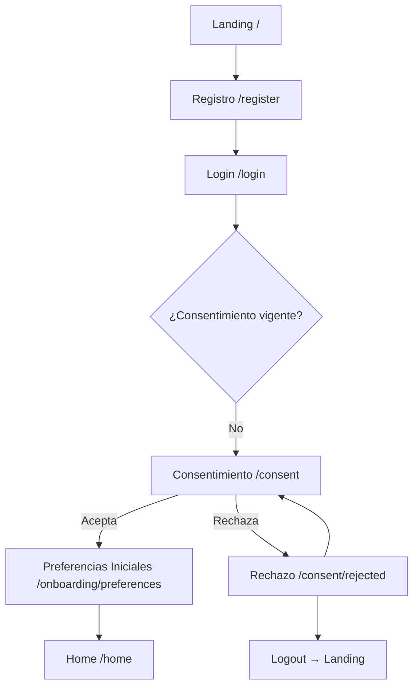
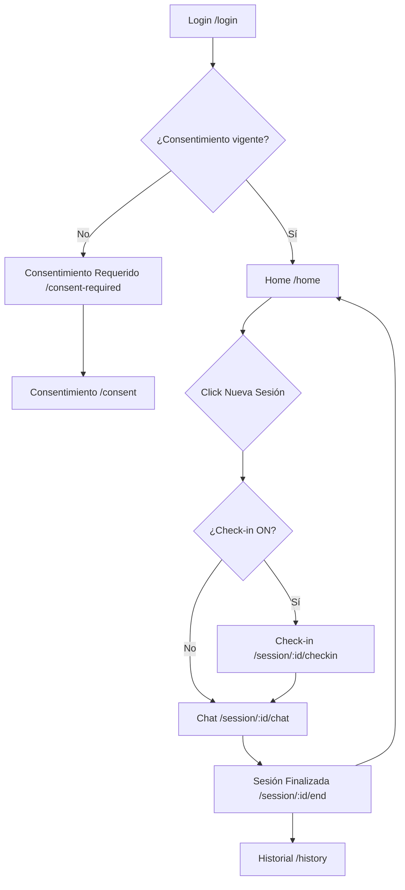
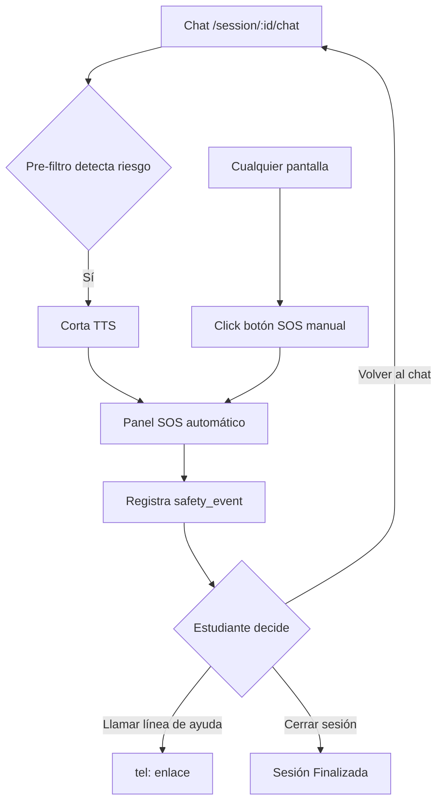
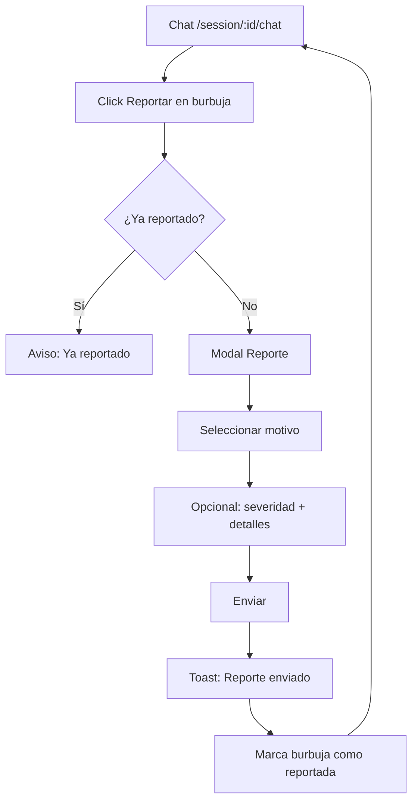
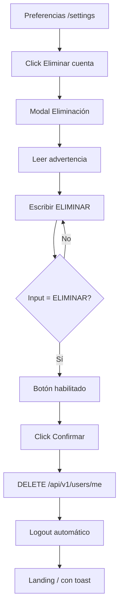
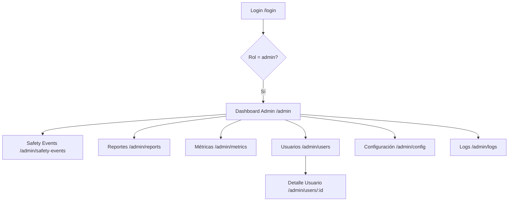
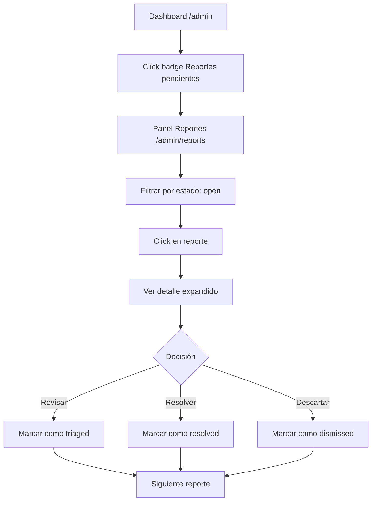

# Interfaces del MVP — Catálogo Funcional Completo

> **Proyecto:** Mabel IA — Asistente de Psicoeducación para Salud Mental Estudiantil UMB
> **Fase:** Pre-desarrollo / diseño
> **Fecha de definición:** 2026-02-20
> **Agentes participantes:** 09 (UX/UI), 08 (Safety), 12 (Ethics), 13 (Research), 05 (Frontend), 04 (Backend), 02 (Architect)

## Resumen Ejecutivo

- **Total de interfaces definidas:** 42 (39 base + 3 adiciones del debate)
- **Distribución por rol:** 22 Estudiante | 10 Administrador | 10 Transversales/Compartidas
- **Restricción:** Este catálogo define estructura funcional y elementos UI — NO define estilo visual, colores, tipografía ni branding.

---

# PARTE A — INTERFACES DEL ESTUDIANTE

---

### #01 — Landing / Bienvenida

**Rol:** Público (sin autenticación)
**HU asociadas:** Ninguna directamente — punto de entrada al sistema
**Ruta:** `/`
**Acceso:** Público

#### Descripción funcional
Primera pantalla que ve cualquier visitante. Explica qué es Mabel IA, su propósito (apoyo psicoeducativo para estudiantes UMB), y ofrece acceso a registro y login. Debe transmitir confianza y seguridad en un contexto de salud mental.

#### Elementos UI
- Logo de Mabel IA: imagen — identidad del sistema
- Título principal: texto — nombre y tagline del asistente
- Descripción breve: texto — qué ofrece Mabel IA (2-3 párrafos)
- Botón "Registrarse": botón primario — navega a `/register`
- Botón "Iniciar sesión": botón secundario — navega a `/login`
- Sección "¿Cómo funciona?": card × 3 — pasos del flujo (registro → consentimiento → chat)
- Sección institucional: texto — mención UMB y contexto académico
- Enlace a política de privacidad: link — abre modal o navega a `/privacy`

#### Acciones disponibles
- Click "Registrarse" → navega a `/register`
- Click "Iniciar sesión" → navega a `/login`
- Click "Política de privacidad" → abre modal con texto legal

#### Estados de la pantalla
- **Loading:** No aplica (contenido estático)
- **Empty:** No aplica
- **Error:** No aplica
- **Success:** No aplica

#### Validaciones
- Ninguna

#### Conexiones
- **Viene de:** URL directa, enlace externo
- **Va a:** `/register`, `/login`
- **Modales que abre:** Modal de política de privacidad (opcional)

---

### #02 — Registro

**Rol:** Público
**HU asociadas:** HU-01 (Registro con email y contraseña)
**Ruta:** `/register`
**Acceso:** Público

#### Descripción funcional
Formulario de registro para nuevos estudiantes. Valida email institucional UMB y fuerza de contraseña en tiempo real. Al registrarse exitosamente, redirige al login con mensaje de confirmación.

#### Elementos UI
- Título: texto — "Crear cuenta"
- Input nombre: input-text — display_name del usuario (obligatorio)
- Input email: input-email — debe ser `@est.umb.edu.co` (obligatorio)
- Input contraseña: input-password — con indicador de fuerza (obligatorio)
- Input confirmar contraseña: input-password — debe coincidir (obligatorio)
- Indicador de fuerza de contraseña: progress-bar — verde/amarillo/rojo
- Botón "Registrarse": botón primario — envía formulario
- Link "¿Ya tienes cuenta? Inicia sesión": link — navega a `/login`
- Mensajes de validación inline: texto de error — debajo de cada campo

#### Acciones disponibles
- Enviar formulario → POST `/api/v1/auth/register` → si éxito: redirect a `/login` con toast "Cuenta creada exitosamente"
- Click "Inicia sesión" → navega a `/login`

#### Estados de la pantalla
- **Loading:** Botón "Registrarse" muestra spinner, inputs deshabilitados
- **Empty:** Estado inicial del formulario
- **Error:** Mensajes inline por campo + toast de error general si falla el servidor
- **Success:** Toast de confirmación + redirect a `/login`

#### Validaciones
- Nombre: obligatorio, mínimo 2 caracteres
- Email: obligatorio, formato válido, dominio `@est.umb.edu.co`
- Contraseña: obligatorio, mínimo 8 caracteres, al menos 1 mayúscula, 1 número, 1 especial
- Confirmar contraseña: debe coincidir con contraseña
- Email duplicado: error del servidor "Este email ya está registrado"

#### Conexiones
- **Viene de:** `/` (Landing)
- **Va a:** `/login` (tras registro exitoso)
- **Modales que abre:** Ninguno

---

### #03 — Login

**Rol:** Ambos (Estudiante y Administrador)
**HU asociadas:** HU-02 (Inicio de sesión)
**Ruta:** `/login`
**Acceso:** Público

#### Descripción funcional
Formulario de inicio de sesión. El backend determina el rol del usuario (student/admin) basándose en el campo `role` de la tabla `users` y redirige al dashboard correspondiente. Incluye links a registro y recuperación de contraseña.

#### Elementos UI
- Título: texto — "Iniciar sesión"
- Input email: input-email — email registrado (obligatorio)
- Input contraseña: input-password — contraseña (obligatorio)
- Checkbox "Recordar sesión": checkbox — extiende duración del JWT
- Botón "Iniciar sesión": botón primario — envía formulario
- Link "¿Olvidaste tu contraseña?": link — navega a `/forgot-password`
- Link "¿No tienes cuenta? Regístrate": link — navega a `/register`
- Mensaje de error general: texto de error — "Credenciales inválidas" (sin revelar qué campo es incorrecto)

#### Acciones disponibles
- Enviar formulario → POST `/api/v1/auth/login` → si éxito: almacenar JWT en Zustand/localStorage → redirect según rol: `/home` (estudiante) o `/admin` (administrador)
- Click "Olvidé contraseña" → navega a `/forgot-password`
- Click "Regístrate" → navega a `/register`

#### Estados de la pantalla
- **Loading:** Botón muestra spinner, inputs deshabilitados
- **Empty:** Estado inicial
- **Error:** Mensaje genérico "Credenciales inválidas" (HU-02: "Error sin filtrar info sensible")
- **Success:** Redirect según rol

#### Validaciones
- Email: obligatorio, formato válido
- Contraseña: obligatorio
- Backend: credenciales válidas, cuenta no eliminada (deleted_at IS NULL)

#### Conexiones
- **Viene de:** `/` (Landing), `/register` (tras registro exitoso)
- **Va a:** `/home` (estudiante) o `/admin` (administrador), `/forgot-password`, `/register`
- **Modales que abre:** Ninguno

---

### #04 — Recuperar Contraseña

**Rol:** Ambos
**HU asociadas:** Requisito técnico: seguridad de acceso
**Ruta:** `/forgot-password`
**Acceso:** Público

#### Descripción funcional
Permite al usuario solicitar un enlace de recuperación de contraseña. Para MVP: genera un token temporal en BD y muestra un enlace simulado (sin SMTP real). En producción: enviaría email con enlace.

#### Elementos UI
- Título: texto — "Recuperar contraseña"
- Texto explicativo: texto — "Ingresa tu email y te enviaremos instrucciones"
- Input email: input-email — email registrado (obligatorio)
- Botón "Enviar enlace": botón primario — envía solicitud
- Link "Volver al login": link — navega a `/login`

#### Acciones disponibles
- Enviar formulario → POST `/api/v1/auth/forgot-password` → muestra pantalla de confirmación
- Click "Volver al login" → navega a `/login`

#### Estados de la pantalla
- **Loading:** Botón muestra spinner
- **Empty:** Estado inicial
- **Error:** "No encontramos una cuenta con ese email" (en producción, por seguridad, siempre mostrar éxito)
- **Success:** Mensaje "Si el email está registrado, recibirás instrucciones" + en MVP: mostrar enlace simulado directamente

#### Validaciones
- Email: obligatorio, formato válido

#### Conexiones
- **Viene de:** `/login`
- **Va a:** `/reset-password/:token` (via enlace), `/login`
- **Modales que abre:** Ninguno

---

### #05 — Restablecer Contraseña

**Rol:** Ambos
**HU asociadas:** Requisito técnico: seguridad de acceso
**Ruta:** `/reset-password/:token`
**Acceso:** Público (requiere token válido)

#### Descripción funcional
Formulario para establecer nueva contraseña, accesible desde el enlace de recuperación. Valida el token antes de mostrar el formulario. Si el token es inválido o expirado, muestra error con opción de solicitar nuevo enlace.

#### Elementos UI
- Título: texto — "Nueva contraseña"
- Input nueva contraseña: input-password — con indicador de fuerza (obligatorio)
- Input confirmar contraseña: input-password — debe coincidir (obligatorio)
- Indicador de fuerza: progress-bar
- Botón "Cambiar contraseña": botón primario
- Mensaje de token inválido: texto de error — si token expirado/inválido
- Link "Solicitar nuevo enlace": link — navega a `/forgot-password`

#### Acciones disponibles
- Enviar formulario → POST `/api/v1/auth/reset-password` con token → si éxito: redirect a `/login` con toast "Contraseña actualizada"
- Click "Solicitar nuevo enlace" → navega a `/forgot-password`

#### Estados de la pantalla
- **Loading:** Verificando token al cargar la página + spinner en botón al enviar
- **Empty:** Formulario listo tras validar token
- **Error:** Token inválido/expirado: "Este enlace ha expirado. Solicita uno nuevo."
- **Success:** Toast + redirect a `/login`

#### Validaciones
- Token: válido y no expirado (validación backend al cargar)
- Nueva contraseña: mínimo 8 caracteres, 1 mayúscula, 1 número, 1 especial
- Confirmar contraseña: debe coincidir

#### Conexiones
- **Viene de:** Enlace de recuperación (email o simulado)
- **Va a:** `/login` (tras éxito), `/forgot-password` (si token inválido)
- **Modales que abre:** Ninguno

---

### #06 — Consentimiento Informado

**Rol:** Estudiante
**HU asociadas:** HU-03 (Aceptar consentimiento informado)
**Ruta:** `/consent`
**Acceso:** Autenticado (se muestra obligatoriamente en primer login si no hay consentimiento vigente)

#### Descripción funcional
Presenta el texto legal completo del consentimiento informado según Ley 1581/2012, obtenido de la versión activa en `consent_versions` (campo `body`). El estudiante DEBE aceptar para continuar usando la plataforma. Ofrece dos opciones de scope: "Solo uso" (datos mínimos para funcionar) y "Uso + mejora anónima" (datos anonimizados para mejorar el servicio). Al aceptar se vincula con `consent_version_id` para trazabilidad legal.

#### Elementos UI
- Título: texto — "Consentimiento Informado"
- Versión del consentimiento: badge — "Versión X.X" (leído de `consent_versions.version`)
- Texto legal completo: textarea readonly / scroll area — contenido del campo `consent_versions.body` de la versión activa
- Sección de propósito: texto — para qué se recopilan datos
- Sección de derechos ARCO: texto — acceso, rectificación, cancelación, oposición
- Selector de scope: radio × 2 — "Solo uso" | "Uso + mejora anónima" (con explicación de cada opción)
- Checkbox de aceptación: checkbox — "He leído y acepto el consentimiento informado" (obligatorio)
- Botón "Aceptar y continuar": botón primario — deshabilitado hasta marcar checkbox y seleccionar scope
- Botón "Rechazar": botón secundario — lleva a pantalla de explicación
- Indicador de scroll: indicador — muestra que el usuario debe leer todo el texto (botón se habilita al llegar al final)

#### Acciones disponibles
- Al montar: GET `/api/v1/consent-versions/active` → obtiene `{id, version, title, body}` de la versión vigente → renderiza título, badge de versión, y texto legal en el scroll area
- Aceptar → POST `/api/v1/consents` con `{ scope, consent_version_id }` → redirect a `/onboarding/preferences`
- Rechazar → navega a pantalla explicativa de por qué es necesario el consentimiento → opción de volver a intentar o cerrar sesión

#### Estados de la pantalla
- **Loading:** Skeleton del texto legal mientras carga versión activa
- **Empty:** No aplica
- **Error carga:** Error al obtener versión vigente de consentimiento: pantalla de error con botón reintentar
- **Sin versión activa:** Si no existe ninguna versión activa en `consent_versions`: mensaje "El consentimiento no está disponible en este momento. Contacta a soporte." + botón cerrar sesión (PO-Q2: placeholder debe existir siempre)
- **Error guardado:** Error al guardar consentimiento: toast de error con reintento
- **Success:** Redirect a preferencias iniciales

#### Validaciones
- Scope: obligatorio seleccionar una opción
- Checkbox: obligatorio marcar
- Scroll: debe haber hecho scroll hasta el final del texto (el botón se habilita progresivamente)

#### Conexiones
- **Viene de:** `/login` (primer login), `/consent-required` (redirect por consentimiento faltante)
- **Va a:** `/onboarding/preferences` (si acepta), pantalla de rechazo (si rechaza)
- **Modales que abre:** Ninguno

---

### #07 — Configuración Inicial de Preferencias

**Rol:** Estudiante
**HU asociadas:** HU-04 (Toggle historial), HU-10 (Toggle check-in), HU-09 (Accesibilidad)
**Ruta:** `/onboarding/preferences`
**Acceso:** Autenticado (solo primera vez tras consentimiento)

#### Descripción funcional
Pantalla de onboarding donde el estudiante configura sus preferencias iniciales. Se presenta de forma amigable y progresiva (stepper). Todas las opciones tienen valores por defecto razonables. El estudiante puede modificarlas después en Preferencias.

#### Elementos UI
- Título: texto — "Personaliza tu experiencia"
- Stepper: stepper — 3 pasos: Privacidad → Accesibilidad → Voz
- **Paso 1 — Privacidad:**
  - Toggle guardar historial: toggle — save_history (default: OFF, explicación clara de qué implica)
  - Toggle check-in al inicio: toggle — checkin_enabled (default: ON)
- **Paso 2 — Accesibilidad:**
  - Selector contraste: select — normal / alto
  - Selector tamaño fuente: select — S / M / L / XL (con preview en vivo)
  - Toggle modo oscuro: toggle
- **Paso 3 — Voz:**
  - Selector voz TTS: select — lista de voces disponibles en español
  - Botón preview voz: botón — reproduce muestra de la voz seleccionada
  - Toggle habilitar subtítulos: toggle — (default: ON)
- Botón "Anterior": botón secundario — vuelve al paso anterior
- Botón "Siguiente": botón primario — avanza al siguiente paso
- Botón "Empezar" (último paso): botón primario — guarda preferencias y navega al home
- Link "Omitir, usar valores predeterminados": link — guarda defaults y navega al home

#### Acciones disponibles
- Navegar entre pasos del stepper
- Click "Empezar" → PUT `/api/v1/preferences` → redirect a `/home`
- Click "Omitir" → PUT `/api/v1/preferences` con defaults → redirect a `/home`

#### Estados de la pantalla
- **Loading:** Spinner en botón al guardar
- **Empty:** Formulario con valores por defecto
- **Error:** Toast de error al guardar
- **Success:** Redirect a `/home`

#### Validaciones
- Todas las opciones tienen defaults válidos — no hay validación obligatoria

#### Conexiones
- **Viene de:** `/consent` (tras aceptar consentimiento)
- **Va a:** `/home`
- **Modales que abre:** Ninguno

---

### #08 — Home / Dashboard del Estudiante

**Rol:** Estudiante
**HU asociadas:** HU-05 (Iniciar sesión de chat), HU-12 (Ver sesiones anteriores)
**Ruta:** `/home`
**Acceso:** Autenticado + Consentimiento vigente

#### Descripción funcional
Pantalla principal del estudiante tras login. Muestra saludo personalizado, acceso rápido a nueva sesión de chat, sesiones recientes (si historial activado), y accesos a preferencias. El panel SOS es siempre accesible.

#### Elementos UI
- Saludo personalizado: texto — "Hola, [display_name]" con mensaje empático según hora del día
- Botón "Nueva sesión": botón primario prominente — inicia nueva sesión de chat
- Sección "Sesiones recientes": card × N — últimas 5 sesiones (solo si save_history = ON)
  - Cada card: fecha, duración, mood del check-in (si aplica), número de mensajes
- Mensaje si historial desactivado: texto — "El historial está desactivado. Puedes activarlo en Preferencias."
- Botón "Ver todo el historial": botón secundario — navega a `/history` (solo si save_history = ON)
- Acceso rápido a preferencias: botón/icono — navega a `/settings`
- Componente SOS: botón flotante o fijo — siempre visible, acceso inmediato

#### Acciones disponibles
- Click "Nueva sesión" → POST `/api/v1/sessions` → redirect a `/session/:id/checkin` (si check-in ON) o `/session/:id/chat` (si check-in OFF)
- Click en sesión reciente → navega a `/history/:id`
- Click "Ver historial" → navega a `/history`
- Click preferencias → navega a `/settings`
- Click SOS → abre Panel SOS (#12)

#### Estados de la pantalla
- **Loading:** Skeleton loaders para sesiones recientes
- **Empty:** Sin sesiones: "Aún no tienes sesiones. ¡Comienza tu primera conversación con Mabel!"
- **Error:** Error al cargar sesiones: toast + botón reintentar
- **Success:** No aplica

#### Validaciones
- Verificar consentimiento vigente al cargar (si no, redirect a `/consent`)

#### Conexiones
- **Viene de:** `/login`, `/onboarding/preferences`, `/session/:id/end`
- **Va a:** `/session/:id/checkin` o `/session/:id/chat`, `/history`, `/history/:id`, `/settings`
- **Modales que abre:** Panel SOS

---

### #09 — Check-in Pre-Sesión

**Rol:** Estudiante
**HU asociadas:** HU-06 (Check-in emocional inicial), HU-10 (Toggle check-in)
**Ruta:** `/session/:id/checkin`
**Acceso:** Autenticado (solo si `preferences.checkin_enabled = true`)

#### Descripción funcional
Formulario breve de bienestar emocional que se presenta al inicio de cada sesión nueva (si el estudiante lo tiene activado). Los datos se guardan en `sessions.checkin_payload` (JSONB) y `sessions.checkin_completed_at`. Sirve para personalizar la conversación y para las métricas de investigación.

#### Elementos UI
- Título: texto — "¿Cómo te sientes hoy?"
- Slider de ánimo: slider — escala 0-10, con etiquetas ("Muy mal" → "Excelente"), con emoji/icono que cambia según valor
- Input horas de sueño: input-text numérico — "¿Cuántas horas dormiste anoche?" (0-24)
- Selector foco de preocupación: select / chip × 6 — "¿Qué te preocupa más?" (académico, personal, social, salud, económico, otro)
- Textarea notas: textarea — "¿Algo que quieras compartir antes de empezar?" (opcional, max 500 chars)
- Contador de caracteres: indicador — X/500
- Botón "Continuar al chat": botón primario — guarda check-in y navega al chat
- Botón "Omitir check-in": botón secundario — navega al chat sin guardar check-in
- Texto informativo: texto — "Esta información ayuda a Mabel a entender mejor cómo te sientes"

#### Acciones disponibles
- Click "Continuar al chat" → PATCH `/api/v1/sessions/:id` con checkin_payload → redirect a `/session/:id/chat`
- Click "Omitir" → redirect a `/session/:id/chat` (checkin_payload queda null)

#### Estados de la pantalla
- **Loading:** Spinner en botón al guardar
- **Empty:** Formulario con valores iniciales (slider en 5, sin selección)
- **Error:** Toast de error al guardar, mantener datos del formulario
- **Success:** Redirect al chat

#### Validaciones
- Ánimo: obligatorio (valor del slider, 0-10)
- Horas de sueño: opcional, si se llena debe ser número 0-24
- Foco: opcional
- Notas: opcional, máximo 500 caracteres

#### Conexiones
- **Viene de:** `/home` (al crear nueva sesión con check-in ON)
- **Va a:** `/session/:id/chat`
- **Modales que abre:** Ninguno

---

### #10 — Chat Principal

**Rol:** Estudiante
**HU asociadas:** HU-05 (Chat), HU-07 (Voz ASR/TTS), HU-08 (Derivación SOS), HU-09 (Subtítulos), HU-14/15/16/17 (Reportes), HU-18 (Avatar 3D con Lip Sync)
**Ruta:** `/session/:id/chat`
**Acceso:** Autenticado

#### Descripción funcional
Interfaz central de conversación con Mabel IA. Soporta texto y voz. Incluye detección de crisis con activación automática del panel SOS, sistema de reportes de mensajes, indicador de TTS/subtítulos, y acceso permanente al botón SOS. Es la pantalla donde el estudiante pasa la mayor parte del tiempo.

#### Elementos UI
- Área de mensajes: contenedor scroll — burbujas de conversación usuario/asistente
  - Burbuja usuario: card — texto del mensaje, timestamp
  - Burbuja asistente: card — texto de respuesta, timestamp, botón reporte (icono), indicador de safety_flags si aplica
- Input de texto: input-text — campo de escritura del mensaje (max 2000 chars)
- Botón enviar: botón — envía mensaje de texto
- Botón micrófono: botón — activa grabación de voz (ASR)
  - Estado grabando: indicador pulsante rojo + "Grabando..." + botón detener
  - Estado procesando: spinner + "Transcribiendo..."
- Indicador "Mabel está escribiendo...": indicador animado — se muestra durante inferencia LLM
- Reproductor TTS: audio-player — reproduce respuesta en voz (si TTS activado)
- Subtítulos TTS: texto sincronizado — aparece debajo del audio si subtítulos activados
- Botón SOS: botón flotante fijo — siempre visible, acceso inmediato al panel SOS
- Botón finalizar sesión: botón secundario — cierra la sesión y navega a pantalla de finalización
- Contador de sesión: indicador — tiempo transcurrido desde inicio de sesión
- Botón reporte (por burbuja asistente): botón/icono — abre modal de reporte (#11)
  - Badge "Ya reportado": badge — si el mensaje ya fue reportado por este usuario (HU-16)
- **[MODO AVATAR — HU-18]** Botón switch "Modo Chat / Modo Avatar": toggle — alterna entre modo burbujas y modo avatar 3D
- **[MODO AVATAR — HU-18]** Canvas 3D del avatar: canvas WebGL — ocupa ~70% del área principal cuando Modo Avatar está activo. Renderiza avatar VRM con lip sync, expresiones faciales contextuales y animaciones (idle, hablando, escuchando, pensando). Lazy-loaded: Three.js y assets solo se cargan al activar el Modo Avatar por primera vez.
- **[MODO AVATAR — HU-18]** Mini-chat compacto: contenedor scroll — últimos mensajes visibles en ~30% inferior del área principal en Modo Avatar
- **[MODO AVATAR — HU-18]** Controles de avatar: grupo — volumen TTS (slider), pausar avatar (toggle)
- **[MODO AVATAR — HU-18]** Indicador de estado del avatar: badge — "Escuchando...", "Pensando...", "Hablando..."

#### Acciones disponibles
- Enviar mensaje texto → POST `/api/v1/sessions/:id/messages` → stream de respuesta → renderizar burbuja
- Grabar audio → POST `/api/v1/asr` (blob audio) → transcripción → insertar en input → enviar como texto
- Click reporte en burbuja → abre Modal Reporte (#11)
- Click SOS → abre Panel SOS (#12)
- Click finalizar → PATCH `/api/v1/sessions/:id` (ended_at) → redirect a `/session/:id/end`
- Activación automática de SOS: si el pre-filtro detecta riesgo → corta TTS → abre Panel SOS → registra safety_event
- **[MODO AVATAR — HU-18]** Click switch "Modo Avatar" → carga lazy del módulo 3D → renderiza canvas + mini-chat (preserva estado de conversación)
- **[MODO AVATAR — HU-18]** Click switch "Modo Chat" → destruye contexto WebGL → vuelve a burbujas completas (preserva estado de conversación)
- **[MODO AVATAR — HU-18]** Ajustar volumen TTS → slider en controles de avatar
- **[MODO AVATAR — HU-18]** Pausar avatar → toggle que congela la animación pero no el audio

#### Estados de la pantalla
- **Loading:** Skeleton de mensajes anteriores al cargar sesión existente
- **Mensaje enviándose:** Burbuja usuario con indicador de envío (opacidad reducida), input deshabilitado
- **Respuesta generándose:** Indicador "Mabel está escribiendo...", stream progresivo de texto
- **Error de conexión:** Toast "No se pudo conectar" + botón reintentar + mensaje del usuario preservado en input
- **Error de ASR:** Toast "No se pudo procesar el audio. Intenta de nuevo."
- **Crisis detectada:** Corte automático de TTS + Panel SOS superpuesto + safety_event registrado
- **Empty:** Primer mensaje: "¡Hola [nombre]! Soy Mabel, estoy aquí para acompañarte. ¿En qué puedo ayudarte hoy?"
- **[MODO AVATAR — HU-18] Modo Avatar - Idle:** Avatar con animación de respiración y parpadeo, mini-chat visible
- **[MODO AVATAR — HU-18] Modo Avatar - Hablando:** Lip sync activo + expresión contextual, audio TTS reproduciéndose
- **[MODO AVATAR — HU-18] Modo Avatar - Escuchando:** Avatar en postura atenta, ASR activo, indicador de grabación
- **[MODO AVATAR — HU-18] Modo Avatar - Pensando:** Avatar con inclinación de cabeza reflexiva, esperando respuesta de Gemini
- **[MODO AVATAR — HU-18] Modo Avatar - Crisis:** Avatar pausado con expresión empática, panel SOS como overlay sobre canvas 3D
- **[MODO AVATAR — HU-18] WebGL no soportado:** Toast "Tu dispositivo no soporta el modo avatar" + permanece en Modo Chat
- **[MODO AVATAR — HU-18] FPS bajo:** Toast de advertencia + opción de volver a Modo Chat

#### Validaciones
- Mensaje: no vacío, máximo 2000 caracteres
- ASR: archivo de audio válido (WebM/Opus)
- Reporte: verificar que no se haya reportado ya este mensaje (HU-16)
- **[MODO AVATAR — HU-18]** WebGL soportado: verificar `WebGLRenderingContext` antes de activar Modo Avatar
- **[MODO AVATAR — HU-18]** FPS monitor: si FPS < 20 en los primeros 5 segundos, notificar y ofrecer fallback a Modo Chat
- **[MODO AVATAR — HU-18]** Tamaño de modelo: verificar que el archivo VRM/GLB ≤ 5MB antes de cargar

#### Conexiones
- **Viene de:** `/session/:id/checkin` o `/home` (nueva sesión sin check-in)
- **Va a:** `/session/:id/end` (al finalizar)
- **Modales que abre:** Modal Reporte (#11), Panel SOS (#12)

#### Sub-interfaz #10B — Modo Avatar (HU-18)

Modo de visualización alternativo del Chat Principal. Comparte ruta (`/session/:id/chat`), estado de sesión, endpoints de backend y pipeline de guardrails con #10. Se activa vía toggle "Modo Chat / Modo Avatar". Lazy-loaded: Three.js y assets 3D solo se cargan al activar por primera vez.

> **Nota:** #10B es una sub-sección de #10, no una interfaz independiente. El total de interfaces top-level sigue siendo 42.

**Elementos UI propios:** Canvas 3D (WebGL ~70% área principal), mini-chat compacto (~30% inferior), controles de avatar (volumen TTS slider, pausar toggle), indicador de estado del avatar (badge).

**Estados propios:** Idle (respiración y parpadeo), Hablando (lip sync activo + expresión contextual), Escuchando (postura atenta, ASR activo), Pensando (inclinación reflexiva), Crisis (avatar pausado, SOS overlay sobre canvas), WebGL no soportado (fallback a Modo Chat), FPS bajo (advertencia + fallback).

**Validaciones propias:** WebGL soportado (`WebGLRenderingContext`), FPS >= 20 (monitor primeros 5s), tamaño modelo VRM/GLB <= 5MB.

**Desarrollo:** Agente 15 (3D & Avatar Engineer) implementa los componentes 3D como módulo independiente. Agente 05 (Frontend) provee la integración con ChatPage vía lazy loading (`React.lazy()` + `Suspense`).

---

### #11 — Modal de Reporte de Mensaje

**Rol:** Estudiante
**HU asociadas:** HU-14 (Reportar mensaje), HU-15 (Motivo del reporte), HU-16 (Evitar duplicados), HU-17 (Confirmación)
**Ruta:** N/A (modal sobre `/session/:id/chat`)
**Acceso:** Autenticado

#### Descripción funcional
Modal que se abre al hacer click en el botón "Reportar" de una burbuja del asistente. Permite seleccionar un motivo, opcionalmente asignar severidad y agregar detalles. Valida que el usuario no haya reportado ya este mensaje (unique constraint en BD).

#### Elementos UI
- Título: texto — "Reportar mensaje"
- Texto del mensaje reportado: texto — preview truncado del mensaje (primeros 100 chars)
- Selector de motivo: radio × 5 — hallucination ("Información incorrecta"), harmful ("Contenido dañino"), privacy ("Problema de privacidad"), low_empathy ("Falta de empatía"), other ("Otro") — obligatorio
- Slider de severidad: slider — 1-5 (opcional), etiquetas "Leve" → "Grave"
- Textarea detalles: textarea — "Cuéntanos más sobre el problema" (opcional, max 1000 chars)
- Botón "Enviar reporte": botón primario
- Botón "Cancelar": botón secundario — cierra modal
- Mensaje "Ya reportado": texto de advertencia — si ya existe reporte (HU-16)

#### Acciones disponibles
- Enviar → POST `/api/v1/messages/:id/reports` → toast "Reporte enviado" (HU-17) → cierra modal → marca burbuja como reportada
- Cancelar → cierra modal sin enviar

#### Estados de la pantalla
- **Loading:** Spinner en botón enviar
- **Empty:** Formulario inicial
- **Error:** Error de servidor: toast + mantener formulario abierto
- **Error duplicado:** "Ya has reportado este mensaje" + cerrar formulario (HU-16)
- **Success:** Toast "Tu reporte fue enviado. Gracias por ayudarnos a mejorar." (HU-17) + cerrar modal

#### Validaciones
- Motivo: obligatorio
- Severidad: opcional (1-5 si se proporciona)
- Detalles: opcional, máximo 1000 caracteres
- Duplicado: verificar UNIQUE(message_id, reporter_id) — mostrar aviso si ya existe

#### Conexiones
- **Viene de:** Click en botón reporte de burbuja en Chat (#10)
- **Va a:** Cierra modal, vuelve al Chat (#10)
- **Modales que abre:** Ninguno

---

### #12 — Panel SOS / Crisis

**Rol:** Estudiante
**HU asociadas:** HU-08 (Derivación si hay riesgo)
**Ruta:** N/A (panel superpuesto, accesible desde cualquier pantalla autenticada)
**Acceso:** Autenticado

#### Descripción funcional
Panel de crisis que puede abrirse de dos formas: (1) manualmente por el estudiante (botón SOS), (2) automáticamente cuando el pre-filtro de guardrails detecta riesgo. En caso de activación automática: se corta el TTS inmediatamente, se registra un safety_event, y el panel aparece superpuesto. El panel NO cierra la sesión — el estudiante puede volver al chat.

#### Elementos UI
- Overlay semitransparente: overlay — oscurece el fondo
- Panel central: card prominente
- Título: texto — "Estamos aquí para ayudarte"
- Mensaje de apoyo empático: texto — mensaje cálido y sin alarma (ej: "No estás solo/a. Hay personas que pueden ayudarte ahora mismo.")
- Líneas de ayuda: card × 3 — cada una con:
  - Nombre del servicio: texto — (Línea 106 - ICBF, Línea 141 - Línea de la Vida, Línea UMB)
  - Número de teléfono: texto prominente — número visible
  - Botón "Llamar": botón — `tel:106`, `tel:141`, etc. (abre marcador del teléfono)
  - Horario: texto — disponibilidad del servicio
- Enlace a recursos: link — "Más recursos de salud mental" (enlace externo)
- Botón "Volver al chat": botón secundario — cierra panel, vuelve a la conversación
- Botón "Cerrar panel": botón/icono — cierra panel

#### Acciones disponibles
- Click "Llamar" → abre enlace `tel:` del dispositivo
- Click "Volver al chat" → cierra panel, vuelve a la pantalla donde estaba
- Click recursos externos → abre enlace en nueva pestaña
- Activación automática: registra POST `/api/v1/safety-events` (event_type: "crisis_detected", payload: safety_flags)

#### Estados de la pantalla
- **Activación manual:** Panel con título estándar y opciones de ayuda
- **Activación automática:** Panel con texto adicional "Mabel detectó que podrías necesitar apoyo. Estas líneas están disponibles 24/7."
- **Loading:** No aplica (contenido estático)
- **Error:** No aplica (datos estáticos, no depende de API)

#### Validaciones
- Ninguna (panel informativo)

#### Conexiones
- **Viene de:** Cualquier pantalla autenticada del estudiante (botón SOS flotante) o activación automática del pre-filtro
- **Va a:** Cierra panel, vuelve a la pantalla anterior
- **Modales que abre:** Ninguno

---

### #13 — Historial de Sesiones

**Rol:** Estudiante
**HU asociadas:** HU-12 (Ver sesiones anteriores), HU-13 (Borrar conversación)
**Ruta:** `/history`
**Acceso:** Autenticado

#### Descripción funcional
Lista paginada de sesiones anteriores ordenadas por fecha (más reciente primero). Solo accesible si `save_history = true`. Cada sesión muestra metadatos resumidos (sin contenido de mensajes). Permite eliminar sesiones con doble confirmación.

#### Elementos UI
- Título: texto — "Mi historial de sesiones"
- Lista de sesiones: card × N — cada card muestra:
  - Fecha y hora de inicio: texto
  - Duración: texto — (ej: "25 minutos")
  - Mood del check-in: chip/tag con emoji — (ej: "Ánimo: 7/10") si hubo check-in
  - Número de mensajes: badge — (ej: "12 mensajes")
  - Botón "Ver detalle": botón — navega a `/history/:id`
  - Botón "Eliminar": botón/icono peligro — abre modal confirmación
- Paginación: botones anterior/siguiente o scroll infinito
- Botón SOS: botón flotante — siempre visible

#### Acciones disponibles
- Click "Ver detalle" → navega a `/history/:id`
- Click "Eliminar" → abre Modal Confirmación genérico (#37) con doble confirmación (HU-13)
- Confirmar eliminación → DELETE `/api/v1/sessions/:id` (CASCADE borra mensajes, attachments, reports) → toast "Sesión eliminada" → actualizar lista

#### Estados de la pantalla
- **Loading:** Skeleton loaders × 5 cards
- **Empty (historial ON, sin sesiones):** "Aún no tienes sesiones guardadas. ¡Inicia una nueva conversación!"
- **Empty (historial OFF):** "El historial está desactivado. Puedes activarlo en Preferencias." + botón a `/settings`
- **Error:** Toast de error + botón reintentar

#### Validaciones
- Verificar `save_history = true` al cargar (si false, mostrar empty state con explicación)

#### Conexiones
- **Viene de:** `/home`
- **Va a:** `/history/:id`, `/settings`
- **Modales que abre:** Modal Confirmación de eliminación (#37)

---

### #14 — Detalle de Sesión

**Rol:** Estudiante
**HU asociadas:** HU-12 (Ver sesiones anteriores), HU-13 (Borrar conversación)
**Ruta:** `/history/:id`
**Acceso:** Autenticado (solo dueño de la sesión)

#### Descripción funcional
Vista de solo lectura de una sesión pasada. Muestra la conversación completa, datos del check-in (si lo hubo), metadatos de la sesión. Permite eliminar la sesión.

#### Elementos UI
- Breadcrumb: breadcrumb — Home > Historial > Sesión [fecha]
- Metadatos de sesión: card — fecha, duración, número de mensajes
- Datos del check-in (si aplica): card — ánimo, horas de sueño, foco, notas
- Conversación completa: contenedor scroll — burbujas de mensajes (solo lectura, sin botón reporte)
- Botón "Eliminar sesión": botón peligro — doble confirmación (HU-13)
- Botón "Volver al historial": botón secundario — navega a `/history`
- Botón SOS: botón flotante — siempre visible

#### Acciones disponibles
- Click "Eliminar" → Modal Confirmación (#37) → DELETE `/api/v1/sessions/:id` → redirect a `/history` con toast "Sesión eliminada"
- Click "Volver" → navega a `/history`

#### Estados de la pantalla
- **Loading:** Skeleton de mensajes
- **Empty:** No aplica (si la sesión existe, tiene al menos 1 mensaje)
- **Error:** "No se pudo cargar la sesión" + botón reintentar
- **Sesión no encontrada:** "Esta sesión no existe o fue eliminada" + botón a `/history`

#### Validaciones
- Verificar que el usuario es dueño de la sesión (user_id = current_user.id)

#### Conexiones
- **Viene de:** `/history`
- **Va a:** `/history` (volver o tras eliminar)
- **Modales que abre:** Modal Confirmación de eliminación (#37)

---

### #15 — Preferencias / Ajustes del Estudiante

**Rol:** Estudiante
**HU asociadas:** HU-04 (Toggle historial), HU-09 (Accesibilidad/subtítulos), HU-10 (Toggle check-in), HU-11 (Toggle historial)
**Ruta:** `/settings`
**Acceso:** Autenticado

#### Descripción funcional
Pantalla de configuración del estudiante organizada por secciones. Permite modificar todas las preferencias, gestionar la cuenta, y ejercer derechos de privacidad (ARCO). Los cambios se guardan individualmente o con botón "Guardar cambios".

#### Elementos UI
- Título: texto — "Preferencias"
- **Sección Privacidad:**
  - Toggle guardar historial: toggle — save_history (con advertencia: "Al desactivar, las sesiones futuras no se guardarán")
  - Toggle check-in inicial: toggle — checkin_enabled
  - Texto informativo: texto — explicación de cada opción
- **Sección Accesibilidad:**
  - Selector contraste: select — normal / alto
  - Selector tamaño fuente: select — S / M / L / XL (con preview)
  - Toggle subtítulos TTS: toggle
  - Toggle modo oscuro: toggle
- **Sección Voz:**
  - Selector voz TTS: select — voces disponibles en español
  - Botón preview voz: botón — reproduce muestra
  - Toggle habilitar TTS: toggle
- **Sección Cuenta:**
  - Email (solo lectura): texto — email del usuario
  - Botón "Cambiar contraseña": botón — abre modal/flujo de cambio
  - Consentimiento vigente: card — versión, scope, fecha de aceptación
  - Botón "Revocar consentimiento": botón peligro — abre Modal Revocación (#17)
  - Botón "Eliminar mi cuenta": botón peligro — abre Modal Eliminación (#16)
- **Sección Mis Datos (ARCO):**
  - Botón "Ver mis datos": botón — muestra qué datos tiene el sistema sobre el usuario
  - Botón "Exportar mis datos": botón — descarga JSON/CSV con datos personales
  - Texto informativo: texto — "Según la Ley 1581/2012, tienes derecho a acceder, rectificar y eliminar tus datos."
- Botón "Guardar cambios": botón primario (sticky en la parte inferior)
- Botón SOS: botón flotante — siempre visible

#### Acciones disponibles
- Cambiar toggles/selectores → actualización de estado local
- Click "Guardar" → PUT `/api/v1/preferences` → toast "Preferencias guardadas"
- Click "Cambiar contraseña" → modal con campos: contraseña actual, nueva, confirmar
- Click "Ver mis datos" → GET `/api/v1/users/me/data` → modal con resumen de datos
- Click "Exportar mis datos" → GET `/api/v1/users/me/export` → descarga archivo
- Click "Revocar consentimiento" → abre Modal Revocación (#17)
- Click "Eliminar cuenta" → abre Modal Eliminación (#16)

#### Estados de la pantalla
- **Loading:** Skeleton de las secciones mientras cargan preferencias
- **Empty:** No aplica (siempre hay preferencias por defecto)
- **Error:** Toast de error al guardar
- **Success:** Toast "Preferencias guardadas exitosamente"

#### Validaciones
- Cambio de contraseña: contraseña actual correcta, nueva con requisitos de fuerza, confirmación coincide

#### Conexiones
- **Viene de:** `/home`, navbar
- **Va a:** `/home` (volver)
- **Modales que abre:** Modal Eliminación (#16), Modal Revocación (#17), Modal cambio contraseña, Modal ver datos

---

### #16 — Modal de Confirmación de Eliminación de Cuenta

**Rol:** Estudiante
**HU asociadas:** Requisito legal: Ley 1581/2012 derecho de supresión
**Ruta:** N/A (modal sobre `/settings`)
**Acceso:** Autenticado

#### Descripción funcional
Modal de doble confirmación para la eliminación irreversible de la cuenta. El estudiante debe escribir "ELIMINAR" para confirmar. Al confirmar, se ejecuta soft-delete del usuario y CASCADE elimina todos los datos asociados.

#### Elementos UI
- Título: texto — "Eliminar cuenta"
- Advertencia: texto prominente — "Se eliminarán todos tus datos de forma irreversible: sesiones, mensajes, preferencias, consentimientos y reportes. Esta acción no se puede deshacer."
- Lista de datos a eliminar: lista — enumera qué se borrará
- Input de confirmación: input-text — placeholder "Escribe ELIMINAR para confirmar"
- Botón "Eliminar mi cuenta": botón peligro — deshabilitado hasta que el input contenga "ELIMINAR"
- Botón "Cancelar": botón secundario — cierra modal

#### Acciones disponibles
- Escribir "ELIMINAR" → habilita botón de confirmar
- Confirmar → DELETE `/api/v1/users/me` → logout → redirect a `/` con toast "Tu cuenta ha sido eliminada"
- Cancelar → cierra modal

#### Estados de la pantalla
- **Loading:** Spinner en botón durante eliminación
- **Error:** Toast de error + mantener modal abierto
- **Success:** Logout automático + redirect a landing

#### Validaciones
- Input: debe contener exactamente "ELIMINAR" (case-sensitive)

#### Conexiones
- **Viene de:** Preferencias (#15)
- **Va a:** `/` (landing, tras eliminación exitosa)
- **Modales que abre:** Ninguno

---

### #17 — Modal de Revocación de Consentimiento

**Rol:** Estudiante
**HU asociadas:** HU-03 (Consentimiento), Requisito legal: Ley 1581/2012 derecho de oposición
**Ruta:** N/A (modal sobre `/settings`)
**Acceso:** Autenticado

#### Descripción funcional
Modal que permite al estudiante modificar o revocar su consentimiento. Ofrece dos opciones: (1) reducir el scope de "uso + mejora anónima" a "solo uso", o (2) revocar totalmente el consentimiento, lo cual bloquea temporalmente el acceso a la plataforma hasta que el estudiante re-acepte la versión vigente (redirect a #22). La revocación total NO implica eliminación de cuenta — la eliminación es una acción independiente accesible desde Preferencias (#15) → Modal Eliminación (#16). Decisión: PO-Q1 (Evo 004).

#### Elementos UI
- Título: texto — "Revocar consentimiento"
- Consentimiento actual: card — versión y scope actual
- Opción 1: radio — "Reducir a solo uso" + explicación: "Se dejarán de usar tus datos para mejora del servicio, pero podrás seguir usando Mabel IA."
- Opción 2: radio — "Revocar completamente" + advertencia: "Al revocar por completo, tu acceso quedará bloqueado temporalmente hasta que aceptes nuevamente el consentimiento vigente. Tus datos se preservan."
- Botón "Confirmar revocación": botón peligro
- Botón "Cancelar": botón secundario

#### Acciones disponibles
- Seleccionar opción 1 → PATCH `/api/v1/consents/current` (scope: "solo_uso") → toast "Consentimiento actualizado" → cierra modal
- Seleccionar opción 2 → PATCH `/api/v1/consents/current` (revoked_at: NOW()) → toast "Consentimiento revocado" → cierra modal → logout → redirect a #22 (Consentimiento Requerido, variante B)
- Cancelar → cierra modal

#### Estados de la pantalla
- **Loading:** Spinner en botón
- **Error:** Toast de error
- **Success (opción 1):** Toast de confirmación + cierra modal
- **Success (opción 2):** Toast "Consentimiento revocado. Deberás aceptarlo nuevamente para continuar." + cierra sesión + redirect a `/consent-required`

#### Validaciones
- Debe seleccionar una opción
- Opción 1 solo visible si scope actual es "uso_mejora_anon" (si ya es "solo_uso", no tiene sentido reducir)

#### Conexiones
- **Viene de:** Preferencias (#15)
- **Va a:** Cierra modal (opción 1) o `/consent-required` (#22, opción 2)
- **Modales que abre:** Ninguno (ya no abre #16)

---

### #18 — Pantalla de Sesión Finalizada

**Rol:** Estudiante
**HU asociadas:** HU-05 (Sesión de chat)
**Ruta:** `/session/:id/end`
**Acceso:** Autenticado

#### Descripción funcional
Se muestra al finalizar una sesión de chat. Presenta un mensaje empático de despedida, resumen de la sesión, y opciones de navegación. Tono cálido y no abrupto.

#### Elementos UI
- Mensaje de despedida: texto — "Gracias por conversar conmigo. Recuerda que estoy aquí cuando me necesites."
- Resumen de sesión: card — duración, número de mensajes, mood del check-in (si aplica)
- Botón "Nueva sesión": botón primario — inicia nueva sesión
- Botón "Ir al inicio": botón secundario — navega a `/home`
- Botón "Ver historial": botón secundario — navega a `/history` (solo si save_history = ON)
- Botón SOS: botón flotante — siempre visible

#### Acciones disponibles
- Click "Nueva sesión" → POST `/api/v1/sessions` → redirect a check-in o chat
- Click "Ir al inicio" → navega a `/home`
- Click "Ver historial" → navega a `/history`

#### Estados de la pantalla
- **Loading:** Skeleton del resumen
- **Error:** Error al cargar resumen: toast (no bloquea navegación)

#### Validaciones
- Ninguna

#### Conexiones
- **Viene de:** `/session/:id/chat` (al finalizar sesión)
- **Va a:** `/session/new/checkin` o `/session/new/chat`, `/home`, `/history`
- **Modales que abre:** Ninguno

---

### #19 — Error 404 — Página No Encontrada

**Rol:** Ambos
**HU asociadas:** Requisito técnico
**Ruta:** `/*` (catch-all)
**Acceso:** Público

#### Descripción funcional
Pantalla de error para rutas inexistentes. Mensaje amigable, sin técnicismos. Ofrece navegación de vuelta.

#### Elementos UI
- Ilustración/icono: imagen — representación visual del error (no alarmante)
- Título: texto — "Página no encontrada"
- Mensaje: texto — "La página que buscas no existe o fue movida."
- Botón "Volver al inicio": botón primario — navega a `/home` (autenticado) o `/` (no autenticado)

#### Acciones disponibles
- Click "Volver" → navega según estado de autenticación

#### Estados de la pantalla
- Estático

#### Conexiones
- **Viene de:** Cualquier URL inválida
- **Va a:** `/home` o `/`

---

### #20 — Error de Conexión

**Rol:** Ambos
**HU asociadas:** Requisito técnico
**Ruta:** N/A (componente superpuesto o inline)
**Acceso:** Cualquiera

#### Descripción funcional
Se muestra cuando no se puede conectar al backend (timeout, servidor caído). Preserva el estado actual del usuario (no pierde el mensaje que estaba escribiendo en el chat).

#### Elementos UI
- Icono de desconexión: icono
- Título: texto — "Sin conexión"
- Mensaje: texto — "No pudimos conectar con el servidor. Verifica tu conexión e intenta de nuevo."
- Botón "Reintentar": botón primario — reintenta la última petición
- Indicador de reintento automático: indicador — "Reintentando en X segundos..." (backoff exponencial)

#### Acciones disponibles
- Click "Reintentar" → reintenta última petición
- Reintento automático con backoff exponencial (3s, 6s, 12s, max 30s)

#### Estados de la pantalla
- **Reintentando:** Spinner + "Conectando..."
- **Reconexión exitosa:** Toast "Conexión restaurada" + continúa flujo

#### Conexiones
- **Viene de:** Cualquier petición fallida
- **Va a:** Restaura la pantalla actual al reconectar

---

### #21 — Sesión Expirada (JWT)

**Rol:** Ambos
**HU asociadas:** Requisito técnico: seguridad
**Ruta:** N/A (modal)
**Acceso:** Autenticado (cuando JWT expira)

#### Descripción funcional
Modal informativo que aparece cuando el JWT expira durante una sesión activa. Preserva contexto si es posible (ej: guarda borrador del mensaje en localStorage).

#### Elementos UI
- Overlay: overlay — bloquea interacción
- Título: texto — "Sesión expirada"
- Mensaje: texto — "Tu sesión ha expirado por seguridad. Por favor, inicia sesión nuevamente."
- Botón "Ir al login": botón primario — navega a `/login`

#### Acciones disponibles
- Click "Ir al login" → limpia estado de auth → navega a `/login`
- Antes de navegar: si hay mensaje en el input del chat, guardarlo en localStorage para restaurar tras login

#### Estados de la pantalla
- Estático (modal informativo)

#### Validaciones
- Ninguna

#### Conexiones
- **Viene de:** Cualquier pantalla autenticada cuando el interceptor de Axios detecta 401
- **Va a:** `/login`

---

### #22 — Consentimiento Requerido

**Rol:** Estudiante
**HU asociadas:** HU-03 (Consentimiento)
**Ruta:** `/consent-required`
**Acceso:** Autenticado (sin consentimiento vigente)

#### Descripción funcional
Pantalla de bloqueo que se muestra cuando un estudiante autenticado intenta acceder a cualquier funcionalidad sin consentimiento vigente. Cubre 3 escenarios: (A) primer acceso sin consentimiento, (B) consentimiento revocado por el usuario (PO-Q1), (C) nueva versión del documento publicada. La variante se determina por el estado del registro en `consents` y la versión activa en `consent_versions`. Layout centrado sin header (consistente con #20, decisión PO #32).

#### Elementos UI
- Título: texto — "Consentimiento requerido"
- **Variante A (sin consentimiento — nuevo usuario):**
  - Mensaje: texto — "Para usar Mabel IA, es necesario aceptar el consentimiento informado. Es un paso importante para proteger tus datos y garantizarte una experiencia segura."
- **Variante B (consentimiento revocado — PO-Q1):**
  - Mensaje: texto — "Tu consentimiento fue revocado anteriormente. Para volver a usar Mabel IA, necesitas aceptar nuevamente el consentimiento vigente."
  - Nota informativa: texto — "Tu cuenta y tus datos se han preservado. Al re-aceptar, podrás continuar donde lo dejaste."
- **Variante C (nueva versión disponible):**
  - Mensaje: texto — "Hay una nueva versión del consentimiento disponible (v.X.X). Por favor, revísala y acéptala para continuar usando Mabel IA."
  - Nota informativa: texto — "Hemos actualizado nuestros términos. Tu aceptación anterior sigue registrada para auditoría."
- Botón "Ir al consentimiento": botón primario — navega a `/consent`
- Botón "Cerrar sesión": botón secundario — logout

#### Acciones disponibles
- Al montar: GET `/api/v1/users/me/consent-status` → determina variante (A, B o C) → renderiza texto correspondiente
- Click "Ir al consentimiento" → navega a `/consent`
- Click "Cerrar sesión" → logout → redirect a `/`

#### Estados de la pantalla
- **Variante A:** Layout centrado sin header
- **Variante B:** Mismo layout, icono indicador de revocación (ej: icono de refresh/restore)
- **Variante C:** Mismo layout, badge de nueva versión visible

#### Validaciones
- El guard de React Router debe determinar la variante ANTES de renderizar (evitar parpadeo entre variantes)

#### Conexiones
- **Viene de:** Cualquier ruta autenticada (guard de React Router verifica consentimiento) o redirect post-revocación desde #17
- **Va a:** `/consent`, `/`

---

# PARTE B — INTERFACES DEL ADMINISTRADOR / INVESTIGADOR

---

### #23 — Login de Administrador

**Rol:** Administrador
**HU asociadas:** Requisito técnico: acceso admin
**Ruta:** `/login` (mismo formulario, backend determina rol)
**Acceso:** Público

#### Descripción funcional
El mismo formulario de login (#03) sirve para ambos roles. El backend determina el rol basándose en `users.role` y responde con un JWT que incluye el claim `role`. El frontend redirige según el rol: estudiante a `/home`, admin a `/admin`.

#### Elementos UI
- Mismos que #03 — Login

#### Acciones disponibles
- Mismas que #03, con redirect condicional según rol del JWT

#### Conexiones
- **Viene de:** `/`
- **Va a:** `/admin` (si rol admin)

*Nota: No se necesita un formulario separado. La separación de roles ocurre en el backend y el routing del frontend.*

---

### #24 — Dashboard Principal del Administrador

**Rol:** Administrador
**HU asociadas:** Requisito técnico: monitoreo del sistema y estudio
**Ruta:** `/admin`
**Acceso:** Autenticado + Rol Admin

#### Descripción funcional
Vista general del estado del sistema con KPIs en tiempo real y gráficas de tendencia. Punto de entrada del panel administrativo. Permite al investigador tener una visión rápida de la salud del sistema, la actividad de los estudiantes, y los indicadores del estudio cuasiexperimental.

#### Elementos UI
- **Cards de KPIs (fila superior):**
  - Total usuarios registrados: card con número + badge "X nuevos esta semana"
  - Sesiones hoy: card con número
  - Safety events (24h): card con número + badge rojo si > 0
  - Reportes pendientes de triaje: card con número + badge rojo si > 0
  - Latencia promedio por turno: card con número + indicador verde (≤20s) / amarillo (20-30s) / rojo (>30s)
  - SUS score promedio: card con número + indicador verde (≥70) / rojo (<70) — "Sin datos" si no hay encuestas
- **Gráficas:**
  - Sesiones por día (30 días): gráfica-líneas — eje X: fecha, eje Y: número de sesiones
  - Distribución de mood del check-in (30 días): gráfica-barras — 3 barras: bajo (0-3), medio (4-6), alto (7-10)
  - Latencia promedio por día (30 días): gráfica-líneas — con línea de referencia horizontal en 20s
  - Safety events por tipo (30 días): gráfica-dona — segmentos por event_type
  - Activaciones de guardrails por día (14 días): gráfica-barras
  - Últimos 5 safety events: tabla — columnas: fecha, tipo, severidad, estado, link a detalle
- **Sidebar (izquierda):** componente Sidebar Admin (#34)

#### Acciones disponibles
- Click en KPI de safety events → navega a `/admin/safety-events`
- Click en KPI de reportes → navega a `/admin/reports`
- Click en fila de safety event en tabla → navega a `/admin/safety-events/:id`
- Selector de período: select — "Últimos 7 días", "Últimos 30 días", "Último mes"

#### Estados de la pantalla
- **Loading:** Skeleton para cada card KPI + skeleton para gráficas
- **Empty:** "No hay datos suficientes para generar gráficas. Los datos aparecerán cuando los estudiantes comiencen a usar Mabel IA."
- **Error:** Toast de error + botón reintentar por sección
- **Datos parciales:** Mostrar gráficas con datos disponibles, indicar "Sin datos" donde no haya

#### Validaciones
- Verificar rol admin al cargar (si no, redirect a `/403`)

#### Conexiones
- **Viene de:** `/login` (con rol admin)
- **Va a:** `/admin/safety-events`, `/admin/reports`, `/admin/metrics`, `/admin/users`, `/admin/config`, `/admin/logs`
- **Modales que abre:** Ninguno

---

### #25 — Panel de Safety Events

**Rol:** Administrador
**HU asociadas:** HU-08 (Derivación), Requisito técnico: monitoreo de seguridad
**Ruta:** `/admin/safety-events`
**Acceso:** Autenticado + Rol Admin

#### Descripción funcional
Tabla paginada de eventos de seguridad (safety_events). Permite filtrar, buscar, y gestionar el estado de cada evento. NO muestra el contenido del mensaje que disparó el evento — solo los safety_flags, timestamps y metadatos. Cumple con la restricción de privacidad (Ley 1581/2012).

#### Elementos UI
- Título: texto — "Eventos de Seguridad"
- **Filtros (barra superior):**
  - Rango de fechas: date-picker × 2 — desde / hasta
  - Tipo de evento: select — todos / crisis_detected / user_report / guardrail_triggered / etc.
  - Severidad: select — todas / 1-5
  - Estado: select — todos / activo / revisado / resuelto
  - Botón "Aplicar filtros": botón
  - Botón "Limpiar filtros": botón secundario
- **Tabla de eventos:**
  - Columnas: fecha/hora, tipo de evento, severidad (badge color), session_id (link truncado, NO contenido), estado (chip), acciones
  - Paginación: botones anterior/siguiente + indicador "Mostrando X-Y de Z"
  - Ordenamiento: click en cabecera de columna para ordenar
- **Panel de detalle (expandible o lateral):**
  - Event_type: texto
  - Timestamp: texto
  - Safety_flags: JSON formateado (risk_detected, keywords, severity)
  - Session_id: link (al admin no le lleva al contenido, solo referencia)
  - Acciones del sistema: texto — qué hizo el sistema (cortó TTS, mostró SOS, etc.)
  - Botón "Marcar como revisado": botón
  - Botón "Marcar como resuelto": botón

#### Acciones disponibles
- Aplicar filtros → re-fetch con query params
- Click en fila → expande detalle
- Marcar como revisado → PATCH `/api/v1/admin/safety-events/:id` (status: "reviewed")
- Marcar como resuelto → PATCH `/api/v1/admin/safety-events/:id` (status: "resolved")
- Exportar → GET `/api/v1/admin/safety-events/export` → descarga CSV

#### Estados de la pantalla
- **Loading:** Skeleton de tabla (5 filas)
- **Empty:** "No se encontraron eventos de seguridad para los filtros seleccionados."
- **Error:** Toast de error + reintentar

#### Validaciones
- Rango de fechas: fecha desde ≤ fecha hasta
- Solo admin puede acceder

#### Conexiones
- **Viene de:** `/admin` (sidebar o click en KPI)
- **Va a:** Detalle de evento (inline)
- **Modales que abre:** Ninguno

---

### #26 — Panel de Reportes de Mensajes (Triaje)

**Rol:** Administrador
**HU asociadas:** HU-14-17 (Reportes de mensajes)
**Ruta:** `/admin/reports`
**Acceso:** Autenticado + Rol Admin

#### Descripción funcional
Tabla paginada de reportes de mensajes (message_reports) para triaje. El admin puede filtrar por motivo, severidad, estado, y gestionar el ciclo de vida de cada reporte (open → triaged → resolved / dismissed). NO muestra el contenido completo del mensaje reportado — solo el motivo, severidad, y detalles escritos por el reportero.

#### Elementos UI
- Título: texto — "Reportes de Mensajes"
- **Indicadores de triaje (fila superior):**
  - Pendientes: badge rojo — número de reportes "open"
  - Revisados hoy: badge — número
  - Tiempo promedio de resolución: indicador — "X horas"
- **Filtros:**
  - Motivo: select — todos / hallucination / harmful / privacy / low_empathy / other
  - Severidad: select — todas / 1-5
  - Estado: select — todos / open / triaged / resolved / dismissed
  - Rango de fechas: date-picker × 2
- **Tabla de reportes:**
  - Columnas: fecha, motivo (chip color), severidad (badge), estado (chip), reporter_id (UUID truncado, anonimizado), acciones
  - Paginación y ordenamiento
- **Panel de detalle (expandible):**
  - Motivo: chip
  - Severidad: badge
  - Detalles del reporte: texto — lo que escribió el reportero
  - Fecha: texto
  - Reporter: UUID truncado (anonimizado)
  - Botón "Marcar como revisado": botón (status: "triaged")
  - Botón "Resolver": botón (status: "resolved")
  - Botón "Descartar": botón (status: "dismissed")

#### Acciones disponibles
- Aplicar filtros → re-fetch
- Click en fila → expande detalle
- Cambiar estado → PATCH `/api/v1/admin/reports/:id` (status: nuevo_estado)
- Exportar → descarga CSV anonimizado

#### Estados de la pantalla
- **Loading:** Skeleton tabla
- **Empty:** "No hay reportes pendientes. ¡Todo en orden!"
- **Error:** Toast + reintentar

#### Validaciones
- Solo admin puede acceder

#### Conexiones
- **Viene de:** `/admin` (sidebar o KPI)
- **Va a:** Detalle de reporte (inline)

---

### #27 — Panel de Métricas de Investigación

**Rol:** Administrador
**HU asociadas:** Requisito de investigación: estudio cuasiexperimental
**Ruta:** `/admin/metrics`
**Acceso:** Autenticado + Rol Admin

#### Descripción funcional
Dashboard de métricas diseñado para el estudio cuasiexperimental (pretest-posttest, 30 estudiantes). Organizado en 5 subsecciones que cubren todos los criterios de éxito del estudio. Permite exportar datos anonimizados para análisis en herramientas externas (SPSS, R, Python).

#### Elementos UI
- Título: texto — "Métricas de Investigación"
- **Controles globales:**
  - Selector rango de fechas: date-picker × 2
  - Botón "Exportar datos (CSV)": botón — descarga CSV anonimizado de todos los datos
  - Botón "Actualizar": botón — refresca datos
- **Tab A — Métricas de Uso:**
  - Usuarios activos por día: gráfica-líneas — eje X: fecha, eje Y: usuarios únicos con sesiones
  - Sesiones por usuario (distribución): gráfica-barras — eje X: rango (1-2, 3-5, 6-10, 10+), eje Y: usuarios
  - Promedio de mensajes por sesión: indicador numérico
  - Duración promedio de sesión: indicador numérico (minutos)
- **Tab B — Métricas de Bienestar (Check-ins):**
  - Mood promedio por día: gráfica-líneas — tendencia longitudinal, eje Y: 0-10
  - Distribución foco de preocupación por semana: gráfica-barras apiladas — 6 categorías × semanas
  - Horas de sueño promedio por día: gráfica-líneas
  - Resumen estadístico del mood: tabla — media, mediana, DE, IC 95%, min, max
- **Tab C — Métricas Técnicas:**
  - Latencia por turno (p50, p95, p99) por día: gráfica-líneas — 3 líneas + referencia en 20s
  - % de turnos ≤ 20s: indicador — porcentaje con verde (≥90%) / rojo (<90%)
  - Tokens consumidos por día: gráfica-barras — tokens_prompt + tokens_completion apilados
  - Costo estimado API Gemini: indicador — cálculo basado en pricing de Gemini
- **Tab D — Métricas de Seguridad:**
  - Safety events por día: gráfica-líneas
  - Distribución de tipos de guardrails: gráfica-dona
  - Tasa de infracciones: indicador — objetivo: 0 (verde si 0, rojo si >0)
  - Top 5 keywords de guardrails: tabla — keywords anonimizadas con frecuencia
- **Tab E — Métricas del Estudio (SUS y Empatía):**
  - Distribución SUS scores: gráfica-barras — si hay datos de encuestas
  - SUS promedio vs objetivo ≥70: indicador — con línea de referencia
  - Distribución rúbrica empatía: gráfica-barras — si hay datos
  - Cohen's d estimado: indicador — tamaño del efecto pre/post
  - Comparativa pre/post bienestar: tabla — grupo, n, media_pre, media_post, diferencia, Cohen's d, p-valor

#### Acciones disponibles
- Navegar entre tabs (A-E)
- Cambiar rango de fechas → re-fetch de todas las métricas
- Exportar CSV → GET `/api/v1/admin/metrics/export` → descarga CSV anonimizado
- Actualizar → re-fetch

#### Estados de la pantalla
- **Loading:** Skeleton por cada gráfica
- **Empty por tab:** "No hay datos de [categoría] para el período seleccionado."
- **Error:** Toast por sección que falló

#### Validaciones
- Solo admin puede acceder
- Rango de fechas válido

#### Conexiones
- **Viene de:** `/admin` (sidebar)
- **Va a:** Ninguna navegación adicional

---

### #28 — Panel de Gestión de Usuarios (Admin)

**Rol:** Administrador
**HU asociadas:** Requisito técnico: gestión de usuarios
**Ruta:** `/admin/users`
**Acceso:** Autenticado + Rol Admin

#### Descripción funcional
Tabla de usuarios registrados con datos agregados. El admin puede ver información general pero NO el contenido de conversaciones. Permite deshabilitar cuentas con justificación.

#### Elementos UI
- Título: texto — "Gestión de Usuarios"
- **Filtros:**
  - Estado consentimiento: select — todos / vigente / revocado / sin consentimiento
  - Rango de registro: date-picker × 2
  - Actividad: select — todos / activo (sesión en 30 días) / inactivo
- **Tabla de usuarios:**
  - Columnas: ID (UUID truncado), email (parcialmente oculto: `e***@est.umb.edu.co`), fecha registro, último acceso, consentimiento (chip: vigente/revocado), total sesiones, acciones
  - Paginación y ordenamiento
- **Acciones por usuario:**
  - Botón "Ver detalle": botón — navega a `/admin/users/:id`
  - Botón "Deshabilitar": botón peligro — abre modal con campo de justificación

#### Acciones disponibles
- Filtrar → re-fetch
- Click "Ver detalle" → navega a `/admin/users/:id`
- Click "Deshabilitar" → modal con textarea de justificación → PATCH `/api/v1/admin/users/:id` (disabled: true, reason) → registra en logs de auditoría

#### Estados de la pantalla
- **Loading:** Skeleton tabla
- **Empty:** "No se encontraron usuarios para los filtros seleccionados."
- **Error:** Toast + reintentar

#### Conexiones
- **Viene de:** `/admin` (sidebar)
- **Va a:** `/admin/users/:id`
- **Modales que abre:** Modal de deshabilitar usuario

---

### #29 — Detalle de Usuario (Admin)

**Rol:** Administrador
**HU asociadas:** Requisito técnico: gestión + Ley 1581/2012 (restricción de acceso)
**Ruta:** `/admin/users/:id`
**Acceso:** Autenticado + Rol Admin

#### Descripción funcional
Vista de datos agregados de un usuario específico. Muestra metadatos, estado del consentimiento, configuración de preferencias, estadísticas de uso. NO muestra contenido de mensajes, detalle de check-ins individuales, ni conversaciones.

#### Elementos UI
- Breadcrumb: breadcrumb — Admin > Usuarios > [UUID truncado]
- **Sección Información General:**
  - Email (parcialmente oculto): texto
  - Fecha de registro: texto
  - Último acceso: texto
  - Estado: chip — activo / deshabilitado
- **Sección Consentimiento:**
  - Versión: texto
  - Scope: chip — solo_uso / uso_mejora_anon
  - Fecha de aceptación: texto
- **Sección Preferencias (estado, no valores exactos):**
  - Save history: chip — ON / OFF
  - Check-in: chip — ON / OFF
  - TTS: chip — ON / OFF
- **Sección Estadísticas de Uso:**
  - Total sesiones: indicador
  - Última sesión: texto (fecha)
  - Promedio mensajes por sesión: indicador
  - Reportes realizados: indicador
  - Safety events asociados: indicador
- Botón "Volver a usuarios": botón — navega a `/admin/users`
- Botón "Deshabilitar cuenta": botón peligro (si no está deshabilitada)

#### Acciones disponibles
- Click "Volver" → navega a `/admin/users`
- Click "Deshabilitar" → modal con justificación

#### Estados de la pantalla
- **Loading:** Skeleton de secciones
- **Error:** "No se pudo cargar la información del usuario"
- **Usuario no encontrado:** "Este usuario no existe"

#### Validaciones
- Solo admin puede acceder
- No mostrar datos que violen privacidad

#### Conexiones
- **Viene de:** `/admin/users`
- **Va a:** `/admin/users`

---

### #30 — Panel de Configuración del Sistema (Admin)

**Rol:** Administrador
**HU asociadas:** Requisito técnico: configuración del sistema
**Ruta:** `/admin/config`
**Acceso:** Autenticado + Rol Admin

#### Descripción funcional
Configuración global del sistema que afecta a todos los usuarios. Permite gestionar versiones de consentimiento, keywords de guardrails, parámetros de la API Gemini, y monitorear el estado de servicios.

#### Elementos UI
- Título: texto — "Configuración del Sistema"
- **Sección Consentimiento:**
  - Versión actual: badge
  - Texto del consentimiento actual: textarea readonly
  - Botón "Crear nueva versión": botón — abre modal con editor de texto
  - Advertencia: texto — "Al crear una nueva versión, los usuarios existentes deberán re-aceptar"
- **Sección Guardrails:**
  - Lista de keywords de riesgo: tabla editable — keyword, categoría, activa (toggle)
  - Botón "Agregar keyword": botón — agrega fila a la tabla
  - Umbral de severidad para SOS automático: slider — 1-5
  - Toggle activar/desactivar guardrails globalmente: toggle (con advertencia si se desactiva)
- **Sección API Gemini:**
  - Estado de conexión: indicador — verde "Conectada" / rojo "Error"
  - Modelo en uso: texto — "gemini-2.0-flash-lite"
  - Timeout configurado: input-text — milisegundos
  - Rate limits: indicador — uso actual vs límite
  - Botón "Test de conexión": botón — envía ping a la API
- **Sección Estado del Sistema:**
  - Versión de la aplicación: texto
  - Estado BD: indicador — verde "Conectada" / rojo "Error"
  - Estado ASR (faster-whisper): indicador — verde / rojo / gris "No configurado"
  - Estado TTS (Piper): indicador — verde / rojo / gris "No configurado"
  - Uptime: indicador
- Botón "Guardar cambios": botón primario (sticky)

#### Acciones disponibles
- Editar keywords → estado local → guardar → PUT `/api/v1/admin/config/guardrails`
- Crear nueva versión de consentimiento → POST `/api/v1/admin/config/consent`
- Cambiar timeout → PUT `/api/v1/admin/config/gemini`
- Test de conexión Gemini → POST `/api/v1/admin/config/gemini/test`
- Todas las acciones se registran en logs de auditoría

#### Estados de la pantalla
- **Loading:** Skeleton de secciones
- **Error:** Toast por sección que falla
- **Success:** Toast "Configuración guardada"

#### Validaciones
- Timeout: número positivo, mínimo 1000ms, máximo 60000ms
- Keywords: no vacías, sin duplicados
- Severidad SOS: 1-5

#### Conexiones
- **Viene de:** `/admin` (sidebar)
- **Va a:** Ninguna

---

### #31 — Panel de Logs y Auditoría (Admin)

**Rol:** Administrador
**HU asociadas:** Requisito legal: Ley 1581/2012 (auditoría de acceso a datos)
**Ruta:** `/admin/logs`
**Acceso:** Autenticado + Rol Admin

#### Descripción funcional
Registro de todas las acciones administrativas para cumplir con requisitos de auditoría de la Ley 1581/2012. Muestra quién hizo qué y cuándo en el panel admin. Los logs son append-only (no se pueden eliminar).

#### Elementos UI
- Título: texto — "Logs de Auditoría"
- **Filtros:**
  - Admin: select — lista de admins
  - Tipo de acción: select — todos / login / view_user / disable_user / change_config / review_report / review_safety_event / export_data
  - Rango de fechas: date-picker × 2
- **Tabla de logs:**
  - Columnas: fecha/hora, admin (email), acción (chip), detalle (texto truncado), IP (opcional)
  - Paginación
  - Expandir fila para ver detalle completo
- Botón "Exportar logs": botón — descarga CSV

#### Acciones disponibles
- Filtrar → re-fetch
- Expandir fila → ver detalle completo
- Exportar → GET `/api/v1/admin/logs/export` → CSV

#### Estados de la pantalla
- **Loading:** Skeleton tabla
- **Empty:** "No se encontraron logs para los filtros seleccionados."
- **Error:** Toast + reintentar

#### Validaciones
- Solo admin puede acceder
- Logs son inmutables (no se pueden editar ni eliminar)

#### Conexiones
- **Viene de:** `/admin` (sidebar)
- **Va a:** Ninguna

---

### #32 — Acceso Denegado (403)

**Rol:** Estudiante (cuando intenta acceder a rutas admin)
**HU asociadas:** Requisito técnico: seguridad de roles
**Ruta:** `/403` (o inline en rutas admin)
**Acceso:** Autenticado (rol estudiante intentando acceder a admin)

#### Descripción funcional
Se muestra cuando un estudiante intenta acceder a rutas del panel administrativo. Mensaje claro sin revelar la existencia de funcionalidades admin.

#### Elementos UI
- Icono: icono — candado o escudo
- Título: texto — "Acceso denegado"
- Mensaje: texto — "No tienes permisos para acceder a esta sección."
- Botón "Volver al inicio": botón primario — navega a `/home`

#### Acciones disponibles
- Click "Volver" → navega a `/home`

#### Estados de la pantalla
- Estático

#### Conexiones
- **Viene de:** Intento de acceso a ruta `/admin/*` con rol student
- **Va a:** `/home`

---

# PARTE C — COMPONENTES TRANSVERSALES

---

### #33 — Header / Navbar

**Rol:** Ambos (con variantes por rol)
**HU asociadas:** HU-02 (Logout), HU-08 (Acceso SOS)
**Ruta:** N/A (componente presente en todas las pantallas autenticadas)
**Acceso:** Autenticado

#### Descripción funcional
Barra de navegación superior presente en todas las pantallas autenticadas. Tiene dos variantes según el rol del usuario.

#### Elementos UI
- **Variante Estudiante:**
  - Logo Mabel IA: imagen/link — click navega a `/home`
  - Nombre del usuario: texto — display_name
  - Botón SOS: botón prominente — abre Panel SOS (#12)
  - Botón/icono preferencias: botón/icono — navega a `/settings`
  - Botón/icono historial: botón/icono — navega a `/history`
  - Botón "Cerrar sesión": botón — logout
- **Variante Admin:**
  - Logo Mabel IA: imagen/link — click navega a `/admin`
  - Nombre del admin: texto
  - Badge de rol: badge — "Admin"
  - Badge safety events: badge rojo — número de eventos no revisados (si > 0)
  - Badge reportes: badge rojo — número de reportes "open" (si > 0)
  - Botón "Cerrar sesión": botón — logout

#### Acciones disponibles
- Click logo → navega a home según rol
- Click SOS → abre Panel SOS (estudiante)
- Click logout → DELETE `/api/v1/auth/logout` → limpia estado → redirect a `/login`

#### Conexiones
- Presente en todas las pantallas autenticadas

---

### #34 — Sidebar del Administrador

**Rol:** Administrador
**HU asociadas:** Requisito técnico: navegación admin
**Ruta:** N/A (componente en todas las pantallas `/admin/*`)
**Acceso:** Autenticado + Rol Admin

#### Descripción funcional
Panel de navegación lateral del administrador. Presente en todas las pantallas del panel admin. Muestra links a todas las secciones con badges de notificación.

#### Elementos UI
- Link "Dashboard": link — `/admin` (icono de home)
- Link "Safety Events": link — `/admin/safety-events` + badge rojo con count
- Link "Reportes": link — `/admin/reports` + badge rojo con count
- Link "Métricas": link — `/admin/metrics` (icono de gráfica)
- Link "Usuarios": link — `/admin/users` (icono de personas)
- Link "Configuración": link — `/admin/config` (icono de engranaje)
- Link "Logs / Auditoría": link — `/admin/logs` (icono de documento)
- Divider: divider
- Indicador de estado sistema: indicador — verde "Sistema OK" / rojo "Error"
- Link activo: highlight — sección actual resaltada

#### Acciones disponibles
- Click en cualquier link → navega a la sección correspondiente

#### Conexiones
- Presente en todas las pantallas `/admin/*`

---

### #35 — Footer

**Rol:** Ambos
**HU asociadas:** Requisito legal: información institucional
**Ruta:** N/A (componente en todas las pantallas excepto chat)
**Acceso:** Público y autenticado

#### Descripción funcional
Pie de página con información institucional, legal y de contacto. No se muestra en la pantalla de chat (#10) para no ocupar espacio de la conversación.

#### Elementos UI
- Versión del sistema: texto — "Mabel IA v1.0.0-MVP"
- Link "Política de privacidad": link — abre modal o página
- Link "Términos de uso": link
- Contacto del equipo: texto — email del equipo de investigación
- Mención institucional: texto — "Universidad Manuela Beltrán — Bogotá, Colombia"
- Año: texto — "2025-2026"

#### Acciones disponibles
- Click en links → abre modales o navega

#### Conexiones
- Presente en todas las pantallas (excepto chat completo)

---

### #36 — Toast / Notificaciones

**Rol:** Ambos
**HU asociadas:** HU-17 (Confirmación de reporte), general
**Ruta:** N/A (componente global)
**Acceso:** Cualquiera

#### Descripción funcional
Sistema de notificaciones flotantes para comunicar resultados de acciones al usuario. Aparecen en la esquina superior derecha, se auto-ocultan tras 5 segundos, y pueden cerrarse manualmente. Soportan 4 tipos: éxito, error, info, warning.

#### Elementos UI
- Contenedor de toasts: contenedor — posición fija, esquina superior derecha
- Toast individual: card flotante
  - Icono de tipo: icono — check (éxito), X (error), info (info), advertencia (warning)
  - Mensaje: texto — descripción de la acción
  - Botón cerrar: botón/icono — cierra el toast
  - Barra de progreso: progress-bar — indica tiempo restante antes de auto-ocultar

#### Tipos de toast:
- **Éxito:** "Preferencias guardadas", "Reporte enviado", "Sesión eliminada"
- **Error:** "No se pudo guardar", "Error de conexión", "Credenciales inválidas"
- **Info:** "Tu sesión expirará pronto", "Nueva versión de consentimiento disponible"
- **Warning:** "Al desactivar el historial, las sesiones futuras no se guardarán"

---

### #37 — Modal Genérico de Confirmación

**Rol:** Ambos
**HU asociadas:** HU-13 (Doble confirmación para eliminar)
**Ruta:** N/A (componente reutilizable)
**Acceso:** Autenticado

#### Descripción funcional
Modal reutilizable para acciones destructivas que requieren confirmación. Usado para: eliminar sesiones, deshabilitar usuarios, cambiar configuraciones críticas. Patrón consistente en toda la aplicación.

#### Elementos UI
- Overlay: overlay — semitransparente
- Título: texto — dinámico según contexto (ej: "¿Eliminar sesión?")
- Mensaje de advertencia: texto — explica consecuencias de la acción
- Input de verificación (opcional): input-text — cuando se requiere escribir texto de confirmación
- Botón "Cancelar": botón secundario
- Botón "Confirmar": botón peligro — dinámico según contexto ("Eliminar", "Deshabilitar", etc.)

#### Variantes:
- **Simple:** Solo título + mensaje + cancelar/confirmar (ej: eliminar sesión)
- **Con verificación:** Título + mensaje + input "Escribe ELIMINAR" + cancelar/confirmar (ej: eliminar cuenta)

---

### #38 — Skeleton Loaders

**Rol:** Ambos
**HU asociadas:** Requisito técnico: UX de carga
**Ruta:** N/A (componente reutilizable)
**Acceso:** Cualquiera

#### Descripción funcional
Placeholders animados que se muestran mientras los datos cargan. Mantienen el layout de la página para evitar saltos de contenido (CLS). Cada pantalla tiene su propio skeleton que replica la estructura de su contenido.

#### Variantes necesarias:
- **Skeleton de card:** Para sesiones recientes en home, KPIs del admin
- **Skeleton de tabla:** Para safety events, reportes, usuarios, logs
- **Skeleton de gráfica:** Para todas las gráficas del dashboard admin y métricas
- **Skeleton de chat:** Para mensajes cargando al abrir sesión existente
- **Skeleton de formulario:** Para preferencias, configuración
- **Skeleton de texto:** Para contenido textual (consentimiento, detalle)

---

### #39 — Empty States

**Rol:** Ambos
**HU asociadas:** Requisito técnico: UX cuando no hay datos
**Ruta:** N/A (componente reutilizable)
**Acceso:** Cualquiera

#### Descripción funcional
Mensajes informativos y constructivos que se muestran cuando una sección no tiene datos. Cada empty state incluye un mensaje y, cuando aplica, una acción sugerida.

#### Variantes necesarias:
- **Sin sesiones (home):** "Aún no tienes sesiones. ¡Comienza tu primera conversación con Mabel!" + botón "Nueva sesión"
- **Historial desactivado:** "El historial está desactivado. Puedes activarlo en Preferencias." + link a preferencias
- **Historial vacío:** "No tienes sesiones guardadas."
- **Sin safety events (admin):** "No se encontraron eventos de seguridad. ¡Todo en orden!"
- **Sin reportes (admin):** "No hay reportes pendientes."
- **Sin métricas (admin):** "No hay datos suficientes. Los datos aparecerán cuando los estudiantes comiencen a usar Mabel IA."
- **Sin usuarios (admin):** "No se encontraron usuarios para los filtros seleccionados."
- **Sin logs (admin):** "No se encontraron logs para los filtros seleccionados."

---

### #40 — Modal de Exportar Mis Datos (ARCO)

**Rol:** Estudiante
**HU asociadas:** Requisito legal: Ley 1581/2012 derecho de acceso
**Ruta:** N/A (modal sobre `/settings`)
**Acceso:** Autenticado

#### Descripción funcional
Modal que muestra al estudiante qué datos tiene el sistema sobre él/ella, y permite exportarlos en formato JSON. Cumple con el derecho de acceso de la Ley 1581/2012. No muestra datos que el sistema no tiene (no inventa).

#### Elementos UI
- Título: texto — "Mis datos personales"
- **Sección de datos mostrados:**
  - Datos de cuenta: card — email, display_name, fecha de registro
  - Consentimiento: card — versión, scope, fecha
  - Preferencias: card — todos los valores actuales
  - Estadísticas de uso: card — total sesiones, total mensajes, total reportes
- Texto legal: texto — "Según la Ley 1581/2012, tienes derecho a conocer, actualizar y solicitar la supresión de tus datos personales."
- Botón "Descargar mis datos (JSON)": botón — descarga archivo
- Botón "Cerrar": botón secundario

#### Acciones disponibles
- Click "Descargar" → GET `/api/v1/users/me/export` → descarga JSON
- Click "Cerrar" → cierra modal

#### Conexiones
- **Viene de:** Preferencias (#15), sección "Mis Datos"
- **Va a:** Cierra modal

---

### #41 — Pantalla de Rechazo de Consentimiento

**Rol:** Estudiante
**HU asociadas:** HU-03 (Consentimiento)
**Ruta:** `/consent/rejected`
**Acceso:** Autenticado

#### Descripción funcional
Se muestra cuando el estudiante rechaza el consentimiento informado. Explica por qué es necesario y ofrece opciones: volver a intentar o cerrar sesión.

#### Elementos UI
- Título: texto — "Consentimiento no aceptado"
- Explicación: texto — "Para proteger tus datos y cumplir con la Ley 1581/2012, Mabel IA requiere tu consentimiento informado para funcionar. Sin él, no podemos procesar tus conversaciones ni almacenar información."
- Lista de beneficios: lista — qué ofrece el consentimiento
- Botón "Volver a revisar el consentimiento": botón primario — navega a `/consent`
- Botón "Cerrar sesión": botón secundario — logout
- Texto de ayuda: texto — "Si tienes dudas, contacta al equipo de investigación: [email]"

#### Conexiones
- **Viene de:** `/consent` (al rechazar)
- **Va a:** `/consent` (si decide revisar), `/` (si cierra sesión)

---

### #42 — Modal de Cambio de Contraseña

**Rol:** Estudiante
**HU asociadas:** Requisito técnico: seguridad de cuenta
**Ruta:** N/A (modal sobre `/settings`)
**Acceso:** Autenticado

#### Descripción funcional
Modal para cambiar la contraseña desde las preferencias. Requiere la contraseña actual para verificar identidad.

#### Elementos UI
- Título: texto — "Cambiar contraseña"
- Input contraseña actual: input-password — obligatorio
- Input nueva contraseña: input-password — con indicador de fuerza
- Input confirmar nueva contraseña: input-password
- Indicador de fuerza: progress-bar
- Botón "Cambiar contraseña": botón primario
- Botón "Cancelar": botón secundario

#### Acciones disponibles
- Enviar → PUT `/api/v1/auth/change-password` → toast "Contraseña actualizada" → cierra modal
- Cancelar → cierra modal

#### Validaciones
- Contraseña actual: obligatorio, verificación en backend
- Nueva contraseña: mínimo 8 caracteres, 1 mayúscula, 1 número, 1 especial
- Confirmar: debe coincidir
- Nueva ≠ actual

#### Conexiones
- **Viene de:** Preferencias (#15)
- **Va a:** Cierra modal

---

# PARTE D — MAPA DE NAVEGACIÓN

## Flujo 1: Estudiante Nuevo

## Flujo 2: Estudiante Recurrente

## Flujo 3: Crisis / SOS

## Flujo 4: Reporte de Mensaje

## Flujo 5: Eliminación de Cuenta

## Flujo 6: Administrador

## Flujo 7: Triaje de Reportes

---

# PARTE E — TRAZABILIDAD HU → INTERFACES

| HU | Descripción | Interfaces Involucradas |
|----|-------------|------------------------|
| HU-01 | Registro con email y contraseña | #02 (Registro) |
| HU-02 | Inicio de sesión / Logout | #03 (Login), #33 (Header — botón logout) |
| HU-03 | Aceptar consentimiento informado | #06 (Consentimiento), #17 (Modal Revocación), #22 (Consentimiento Requerido), #41 (Rechazo Consentimiento) |
| HU-04 | Elegir si guardar historial | #07 (Config Inicial), #15 (Preferencias — toggle save_history) |
| HU-05 | Iniciar sesión de chat | #08 (Home — botón Nueva Sesión), #10 (Chat Principal), #18 (Sesión Finalizada) |
| HU-06 | Check-in emocional inicial | #09 (Check-in Pre-Sesión) |
| HU-07 | Hablar por voz (ASR/TTS) | #10 (Chat — botón micrófono, reproductor TTS) |
| HU-08 | Derivación si hay riesgo (SOS) | #12 (Panel SOS), #25 (Panel Safety Events — admin), #33 (Header — botón SOS) |
| HU-09 | Subtítulos para accesibilidad | #10 (Chat — subtítulos TTS), #07 (Config Inicial — accesibilidad), #15 (Preferencias — accesibilidad) |
| HU-10 | Toggle check-in | #07 (Config Inicial), #15 (Preferencias — toggle checkin_enabled) |
| HU-11 | Toggle historial | #07 (Config Inicial), #15 (Preferencias — toggle save_history) |
| HU-12 | Ver sesiones anteriores | #13 (Historial de Sesiones), #14 (Detalle de Sesión), #08 (Home — sesiones recientes) |
| HU-13 | Borrar conversación | #13 (Historial — botón eliminar), #14 (Detalle — botón eliminar), #37 (Modal Confirmación) |
| HU-14 | Reportar mensaje del asistente | #11 (Modal Reporte), #10 (Chat — botón reporte por burbuja) |
| HU-15 | Motivo del reporte | #11 (Modal Reporte — selector de motivo) |
| HU-16 | Evitar reportes duplicados | #11 (Modal Reporte — validación duplicado), #10 (Chat — badge "Ya reportado") |
| HU-17 | Confirmación de envío de reporte | #11 (Modal Reporte — toast de éxito), #36 (Toast) |
| HU-18 | Avatar 3D con Lip Sync | #10B (sub-interfaz de #10 — Modo Avatar), #15 (Preferencias — toggle preferred_chat_mode) |

### Interfaces NO asociadas a HU específicas

| Interfaz | Requisito Origen |
|----------|-----------------|
| #01 Landing | Punto de entrada al sistema |
| #04 Recuperar contraseña | Requisito técnico: seguridad de acceso |
| #05 Restablecer contraseña | Requisito técnico: seguridad de acceso |
| #16 Modal eliminar cuenta | Requisito legal: Ley 1581/2012 derecho de supresión |
| #19 Error 404 | Requisito técnico: manejo de errores |
| #20 Error de conexión | Requisito técnico: resiliencia |
| #21 Sesión expirada JWT | Requisito técnico: seguridad |
| #23-#32 (Panel Admin completo) | Requisito de investigación: estudio cuasiexperimental + Ley 1581/2012 auditoría |
| #33-#39 (Transversales) | Requisito técnico: UX consistente |
| #40 Modal Exportar Datos | Requisito legal: Ley 1581/2012 derecho de acceso |
| #41 Rechazo Consentimiento | HU-03 (flujo alternativo) |
| #42 Modal Cambio Contraseña | Requisito técnico: seguridad de cuenta |

---

# PARTE F — VALIDACIONES DE AGENTES (FASE 5)

## Agente 08 — Safety & Guardrails

**1. ¿Panel SOS accesible desde TODAS las pantallas del estudiante?**
- CUMPLE. El botón SOS flotante está definido en: #08 (Home), #09 (Check-in), #10 (Chat), #13 (Historial), #14 (Detalle sesión), #15 (Preferencias), #18 (Sesión finalizada). El Panel SOS (#12) es accesible como componente superpuesto desde cualquier pantalla autenticada.

**2. ¿Flujo de crisis completo?**
- CUMPLE. Flujo completo: Chat (#10) → Pre-filtro detecta riesgo → Corta TTS → Panel SOS (#12) aparece automáticamente → Registra safety_event (POST `/api/v1/safety-events`) → Ofrece líneas de ayuda (106, 141, UMB) con enlaces `tel:` → Estudiante puede volver al chat o cerrar sesión.

**3. ¿Safety_events en admin sin violar privacidad?**
- CUMPLE. Panel Safety Events (#25) muestra: event_type, severity, timestamp, safety_flags (risk_detected, keywords). NO muestra contenido del mensaje que disparó el evento. Session_id es referencia truncada, no enlace al contenido.

**4. ¿Elementos adicionales propuestos?**
- El badge de "Ya reportado" en las burbujas del chat (#10) cubre HU-16.
- El flujo automático de corte TTS + SOS está integrado.
- Se recomienda agregar un indicador visual en el header (#33) cuando hay un safety_event activo en la sesión actual (implementación sugerida: badge de atención en el botón SOS).

## Agente 12 — Ethics & Privacy

**1. ¿Consentimiento bloquea acceso sin aceptación?**
- CUMPLE. React Router guard verifica consentimiento vigente → si no hay → redirect a `/consent-required` (#22) → debe aceptar en `/consent` (#06) para continuar. Rechazo lleva a `/consent/rejected` (#41) con opción de volver a intentar o cerrar sesión.

**2. ¿Admin puede ver contenido de conversaciones?**
- NO (correcto). Verificado en todas las pantallas admin:
  - #25 Safety Events: solo safety_flags, NO contenido
  - #26 Reportes: solo motivo/severidad/detalles del reportero, NO mensaje completo
  - #28 Usuarios: datos agregados, NO conversaciones
  - #29 Detalle Usuario: estadísticas, NO mensajes
  - #27 Métricas: datos agregados
  - Ninguna pantalla admin tiene acceso a messages.content

**3. ¿Derecho de supresión con doble confirmación?**
- CUMPLE. Modal #16 requiere: leer advertencia + escribir "ELIMINAR" + click confirmar. DELETE CASCADE elimina todos los datos asociados (sesiones, mensajes, attachments, reports, safety_events, preferences, consents).

**4. ¿Logs de auditoría registran TODAS las acciones admin?**
- CUMPLE. Panel #31 registra: login, view_user, disable_user, change_config, review_report, review_safety_event, export_data. Logs son append-only (inmutables). Todas las acciones de #25, #26, #28, #30 se registran.

**5. ¿Derechos ARCO implementados?**
- CUMPLE.
  - Acceso: Modal #40 muestra datos + botón exportar JSON
  - Rectificación: Preferencias (#15) permite modificar datos configurables
  - Cancelación: Modal #16 (eliminar cuenta) + Modal #17 (revocar consentimiento)
  - Oposición: Modal #17 permite revocar scope de mejora anónima

## Agente 13 — Research & Analytics

**1. ¿Métricas cubren TODOS los criterios de éxito?**
- CUMPLE.
  - SUS ≥ 70: Tab E (#27) — distribución SUS + promedio vs objetivo
  - Latencia ≤ 20s: Tab C (#27) — p50/p95/p99 + % ≤20s + línea referencia
  - Efecto ≥ 0.3: Tab E (#27) — Cohen's d + tabla comparativa pre/post
  - 0 infracciones: Tab D (#27) — tasa de infracciones con indicador
  - Empatía ≥ 4/5 en ≥80%: Tab E (#27) — distribución rúbrica empatía

**2. ¿Exportación de datos anonimizados?**
- CUMPLE. Botón "Exportar datos (CSV)" en #27 → descarga CSV anonimizado. Compatible con SPSS/R/Python para análisis externo.

**3. ¿Instrumentos del estudio (SUS, rúbrica)?**
- OBSERVACIÓN: Los instrumentos SUS y rúbrica de empatía se administran FUERA del sistema (formularios físicos o Google Forms durante las sesiones presenciales del estudio). Los resultados se importan al sistema para las métricas de Tab E. Se necesita un endpoint de importación de datos (POST `/api/v1/admin/metrics/import`) o una interfaz de carga manual.

## Agente 05 — Frontend Developer

**1. ¿Cada pantalla mapea a componente React viable?**
- CUMPLE. 42 interfaces mapean a ~35 componentes React (algunos comparten layout). Estructura de carpetas sugerida:
  - `pages/public/` — Landing, Register, Login, ForgotPassword, ResetPassword
  - `pages/student/` — Home, Consent, OnboardingPreferences, Chat, CheckIn, SessionEnd, History, SessionDetail, Settings
  - `pages/admin/` — Dashboard, SafetyEvents, Reports, Metrics, Users, UserDetail, Config, Logs
  - `pages/error/` — NotFound, Forbidden
  - `components/` — Header, Sidebar, Footer, Toast, ConfirmModal, SkeletonLoader, EmptyState, SOSPanel, ReportModal

**2. ¿Estados definidos para todas las pantallas?**
- CUMPLE. Todas las pantallas con datos dinámicos tienen: Loading (skeleton), Empty (empty state), Error (toast + reintentar), Success (toast/redirect).

**3. ¿React Router v6 viable?**
- CUMPLE. Estructura de rutas anidadas:
  - Layout público: `/`, `/register`, `/login`, `/forgot-password`, `/reset-password/:token`
  - Layout estudiante (guard: auth + consent): `/home`, `/session/:id/*`, `/history`, `/history/:id`, `/settings`
  - Layout admin (guard: auth + admin role): `/admin`, `/admin/*`

**4. ¿Librería de gráficas?**
- Recharts (≥2.12) — declarativo, compatible React 18, soporta todos los tipos necesarios (líneas, barras, dona, barras apiladas). ~45KB gzipped.

**5. ¿Zustand suficiente?**
- CUMPLE. Stores: `authStore` (user, token, role), `preferencesStore` (todos los toggles), `chatStore` (messages, isLoading, isRecording), `adminStore` (filters, pagination). No necesita Redux.

**6. ¿WebSocket/SSE necesario?**
- Para MVP: NO estrictamente. El streaming de respuestas LLM puede usar SSE (Server-Sent Events) vía `EventSource` o `fetch` con streaming. Los badges de notificación del admin pueden usar polling cada 30s. SSE recomendado solo para el chat (#10) si se quiere streaming palabra por palabra.

## Agente 04 — Backend Developer

**1. Endpoints API nuevos necesarios:**

**Auth:**
- `POST /api/v1/auth/register` — registro
- `POST /api/v1/auth/login` — login (retorna JWT con role)
- `DELETE /api/v1/auth/logout` — logout (invalidar token)
- `POST /api/v1/auth/forgot-password` — solicitar recuperación
- `POST /api/v1/auth/reset-password` — restablecer contraseña
- `PUT /api/v1/auth/change-password` — cambiar contraseña (autenticado)

**Estudiante:**
- `GET /api/v1/users/me` — datos del usuario actual
- `PUT /api/v1/users/me` — actualizar display_name
- `DELETE /api/v1/users/me` — eliminar cuenta (soft-delete + CASCADE)
- `GET /api/v1/users/me/data` — datos personales (ARCO)
- `GET /api/v1/users/me/export` — exportar datos (JSON)
- `POST /api/v1/consents` — aceptar consentimiento
- `PATCH /api/v1/consents/current` — modificar scope
- `GET /api/v1/preferences` — obtener preferencias
- `PUT /api/v1/preferences` — actualizar preferencias
- `POST /api/v1/sessions` — crear sesión
- `PATCH /api/v1/sessions/:id` — actualizar sesión (check-in, ended_at)
- `GET /api/v1/sessions` — listar sesiones del usuario (paginado)
- `GET /api/v1/sessions/:id` — detalle de sesión con mensajes
- `DELETE /api/v1/sessions/:id` — eliminar sesión (CASCADE)
- `POST /api/v1/sessions/:id/messages` — enviar mensaje (retorna respuesta LLM)
- `POST /api/v1/asr` — transcripción de audio (faster-whisper)
- `POST /api/v1/messages/:id/reports` — crear reporte
- `POST /api/v1/safety-events` — registrar evento (automático desde guardrails)

**Admin:**
- `GET /api/v1/admin/dashboard` — KPIs agregados
- `GET /api/v1/admin/safety-events` — listar eventos (paginado + filtros)
- `PATCH /api/v1/admin/safety-events/:id` — cambiar estado
- `GET /api/v1/admin/safety-events/export` — exportar CSV
- `GET /api/v1/admin/reports` — listar reportes (paginado + filtros)
- `PATCH /api/v1/admin/reports/:id` — cambiar estado
- `GET /api/v1/admin/reports/export` — exportar CSV
- `GET /api/v1/admin/metrics/usage` — métricas de uso
- `GET /api/v1/admin/metrics/wellbeing` — métricas de bienestar
- `GET /api/v1/admin/metrics/technical` — métricas técnicas
- `GET /api/v1/admin/metrics/safety` — métricas de seguridad
- `GET /api/v1/admin/metrics/study` — métricas del estudio
- `GET /api/v1/admin/metrics/export` — exportar CSV anonimizado
- `GET /api/v1/admin/users` — listar usuarios (paginado + filtros)
- `GET /api/v1/admin/users/:id` — detalle usuario (agregado)
- `PATCH /api/v1/admin/users/:id` — deshabilitar/habilitar
- `GET /api/v1/admin/config` — obtener configuración
- `PUT /api/v1/admin/config/guardrails` — actualizar keywords/umbrales
- `POST /api/v1/admin/config/consent` — crear nueva versión consentimiento
- `PUT /api/v1/admin/config/gemini` — actualizar config Gemini
- `POST /api/v1/admin/config/gemini/test` — test de conexión
- `GET /api/v1/admin/logs` — listar logs de auditoría
- `GET /api/v1/admin/logs/export` — exportar logs CSV

**Total: ~40 endpoints**

**2. ¿Tablas/columnas adicionales?**
- Columna `role TEXT NOT NULL DEFAULT 'student' CHECK (role IN ('student','admin'))` en tabla `users`
- Columna `status TEXT NOT NULL DEFAULT 'active'` en tabla `safety_events` (para workflow revisado/resuelto)
- Tabla nueva sugerida: `audit_logs` (id UUID, admin_id UUID FK users, action TEXT, detail JSONB, ip TEXT, created_at TIMESTAMP) — para Panel de Logs (#31)
- Tabla nueva sugerida: `password_reset_tokens` (id UUID, user_id UUID FK users, token TEXT UNIQUE, expires_at TIMESTAMP, used_at TIMESTAMP) — para flujo de recuperación de contraseña
- Columna `disabled_at TIMESTAMP` y `disabled_reason TEXT` en tabla `users` — para deshabilitar cuentas desde admin

**3. ¿Roles suficientes?**
- Sí. Dos roles (student/admin) son suficientes para MVP. Los permisos se validan con middleware/decorador que verifica `role` en el JWT.

## Agente 02 — Software Architect

**1. ¿Flujo de navegación coherente?**
- CUMPLE. No hay pantallas huérfanas. Todos los flujos tienen entrada y salida definidas. El mapa de navegación (Parte D) confirma conectividad completa.

**2. ¿Separación de roles limpia?**
- CUMPLE. Routing:
  - Rutas públicas: `/`, `/register`, `/login`, `/forgot-password`, `/reset-password/:token`
  - Rutas estudiante (guard: `AuthGuard` + `ConsentGuard`): `/home`, `/session/*`, `/history/*`, `/settings`, `/consent*`
  - Rutas admin (guard: `AuthGuard` + `AdminGuard`): `/admin/*`
  - Guards son composables y se inyectan en el layout de React Router

**3. ¿Riesgos arquitectónicos?**
- **Riesgo 1 — Streaming SSE**: El chat (#10) con streaming palabra por palabra requiere SSE. FastAPI soporta `StreamingResponse`, pero el frontend necesita manejar la reconexión si se pierde conexión. Mitigación: implementar reconexión automática con backoff en el EventSource del chat.
- **Riesgo 2 — Métricas pesadas**: Las queries de métricas (#27) con JOINs y agregaciones sobre toda la BD pueden ser lentas si crecen los datos. Mitigación para MVP: aceptable con 30 estudiantes; si crece, considerar vistas materializadas.
- **Riesgo 3 — Consistencia de gráficas**: Las gráficas del admin dependen de datos que se actualizan continuamente. El polling cada 30s es suficiente para MVP, pero SSE sería ideal para producción.

---

# PARTE G — REGISTRO DE DECISIONES DEL DEBATE (FASE 1)

| # | Decisión | Justificación | Agentes |
|---|----------|---------------|---------|
| D-01 | Login unificado (student + admin en mismo formulario) | Simplifica UI. El backend determina el rol y el frontend redirige. No se necesita una URL separada `/admin/login`. | 02, 05, 09 |
| D-02 | Panel SOS como componente flotante, no página separada | El SOS debe ser instantáneo, sin navegación. Un overlay/panel superpuesto es más rápido y no interrumpe el contexto del chat. | 08, 09 |
| D-03 | Recuperación de contraseña simplificada para MVP | Sin SMTP real — se genera un token en BD y se muestra un enlace simulado. En producción se habilitará el envío de email real. | 04, 11 |
| D-04 | Recharts para gráficas del admin | Declarativo, integración nativa con React 18, ~45KB gzipped, soporta todos los tipos de gráficas necesarios (líneas, barras, dona, apiladas). Chart.js requiere wrapper adicional. | 05, 13 |
| D-05 | Derechos ARCO como sección en Preferencias | En vez de una pantalla separada, se incluyen en la sección "Mis Datos" de Preferencias (#15) para no complicar la navegación del estudiante. | 09, 12 |
| D-06 | Logs de auditoría en tabla separada (audit_logs) | No reutilizar safety_events porque son conceptualmente diferentes. Los audit_logs registran acciones del admin, los safety_events registran riesgos del estudiante. | 03, 04, 12 |
| D-07 | No se implementa chat en tiempo real multi-usuario | Mabel IA es un chat 1:1 (estudiante ↔ IA). No se necesita WebSocket para comunicación entre usuarios. SSE solo para streaming de respuestas LLM. | 02, 04 |
| D-08 | Empty states con acción sugerida | Cada empty state incluye un mensaje constructivo y un botón de acción (ej: "Aún no tienes sesiones → Nueva sesión"). Mejora la experiencia en un contexto de salud mental. | 09, 08 |
| D-09 | Consentimiento con scroll obligatorio | El botón de aceptar se habilita progresivamente al hacer scroll hasta el final del texto legal. Garantiza que el estudiante haya visto todo el contenido. | 12, 09 |
| D-10 | Tabla password_reset_tokens separada de users | Los tokens de reset son temporales y con expiración. Mezclarlos en la tabla users añade columnas temporales innecesarias. | 03, 04 |
| D-11 | Instrumentos SUS/empatía administrados externamente | Los cuestionarios SUS y rúbrica de empatía se administran fuera de Mabel IA (formularios presenciales o Google Forms). Los resultados se importan al sistema para métricas. Se necesita endpoint de importación. | 13, 04 |
| D-12 | 3 interfaces adicionales (42 total vs 39 original) | Añadidas: #40 (Modal Exportar Datos ARCO), #41 (Rechazo Consentimiento), #42 (Modal Cambio Contraseña). Todas necesarias para completitud legal y funcional. | 12, 08, 09 |
